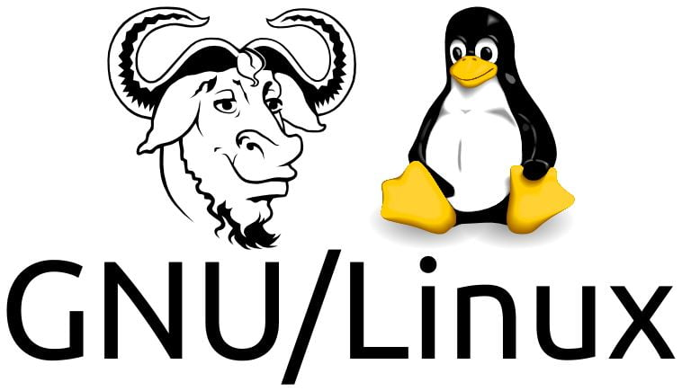
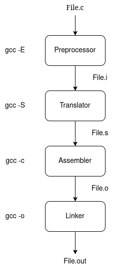
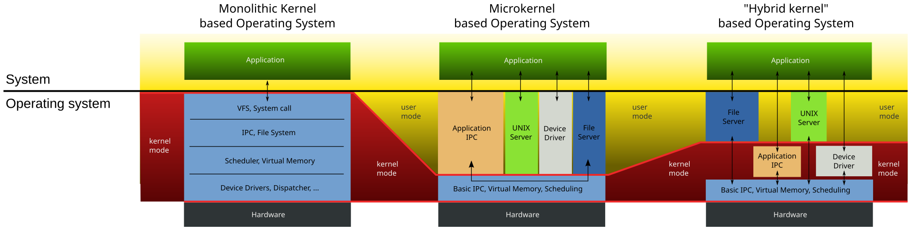

# Linux: Embedded development

------

## Introduction to Linux 

------

### Definition:

- Linux is a member of the UNIX family of operating systems.
- Precisely speaking, the term Linux refers just to the kernel developed by Linus Torvalds and others. However, the term Linux is commonly used to mean the kernel, plus a wide range of other software (tools and libraries) that together make a complete operating system. 

###  History:

- Unix (1969)
  - The UNIX system was first implemented in 1969 on a Digital PDP-7 minicomputer by Ken Thompson at Bell Laboratories (part of AT&T). The operating system drew many ideas, as well as its punned name, from the earlier MULTICS system. By
    1973, UNIX had been moved to the PDP-11 mini-computer and rewritten in C, a programming language designed and implemented at Bell Laboratories by Dennis Ritchie. Legally prevented from selling UNIX, AT&T instead distributed the complete system to universities for a nominal charge. This distribution included source code, and became very popular within universities, since it provided a cheap operating system whose code could be studied and modified by computer science academics and students.

- The GNU Project (1984)

  - In 1984, Richard Stallman, an exceptionally talented programmer who had been working at MIT, set to work on creating a “free” UNIX implementation.
  -  In 1985, Stallman founded the Free Software Foundation (FSF), a non-profit organization to support the GNU project as well as the development of free software in general.
  - One of the important results of the GNU project was the development of the GNU General Public License (GPL), the legal embodiment of Stallman’s notion of free software.																	

- The Linux Kernel (1991):

  

  - In 1991, Linus Torvalds, a Finnish student at the University of Helsinki, was inspired to write an operating system for his Intel 80386 PC.
  - Inspired by Minix, a small UNIX-like operating system kernel Torvalds started on a project to create an efficient, full-featured UNIX kernel to run on the 386. Over a few months, Torvalds developed a basic kernel that allowed him to compile and run various GNU programs. Then, on
    October 5, 1991, Torvalds requested the help of other programmers, making the following now much-quoted announcement of version 0.02 of his kernel in the comp.os.minix
  - Like most free software projects, Linux follows a release-early, release-often model, so that new kernel revisions appear frequently (sometimes even daily). As the Linux user base increased, the release model was adapted to decrease disruption to existing users. Specifically, following the release of Linux 1.0, the kernel developers adopted a kernel version numbering scheme with each release numbered x.y.z: x representing a major version, y a minor version within that major version, and z a revision of the minor version (minor improvements and bug fixes).
  - As a general goal, Linux (i.e., kernel, glibc, and tool) development aims to conform to the various UNIX standards, especially POSIX and the Single UNIX Specification.

### Man page Section Numbers

- 2 for system API   eg: man 2 open

- 3 for Library Functions  eg: man 3 fopen

- 7 for Subsystems and kernel components  eg: man 7 tcp

- run man man to understand about man sections in detail

  

### C compilation 

- Understanding translation would lead to writing more efficient programming.
- `Objdump -D` (Dis assembler all flag) is used to display the information from the object files
  - `objdump -x` to see all header info
  - `objdump --disassemble` to generate assembly code from the object file
- `ldd` is a tool used to print shared object dependencies
- `-v` (verbose) can be used to display more insights
  - eg: `gcc -E -v a.c -o a.i`
- 
- GCC initially runs con-fig script which verifies dependencies
- cc1 is the tool for compiling and pre-processing 
- Compilation involves pre processor, translator and assembler.
- Build involves linking.
- Binary are two types **Relocatable** Binary and **Executable** Binary.
- In UNIX/Linux the preferred binary format is **ELF**
  - **[Executable and Linkable Format PDF](./PDFs/ELF_Format.pdf)**
- In Windows the preferred binary format is **COFF**
- GCC on windows has different assembler and linker to generate coff
- we can take a `app.s` file (assembly file) generated in Linux and use it to generate a executable in windows
- Relocatable binary only has address offsets, linker **assigns** load addresses to object file (instruction relocation, procedure relocation and function call relocation)
- Linker appends run time routines \ bootstrap code. optionally resolving library call relocation
- Run time code **initialises** the heap section and stack section.
- Run time code also provides command line arguments to main `_start`(constructor) `_fini` (destructor)
- Run time code is always OS specific
- [How main in executed in Linux](https://linuxgazette.net/issue84/hawk.html)

### Application Binary Interface (ABI)

- An application binary interface (ABI) is a set of rules specifying how a binary executable should exchange information with some service (e.g., the kernel or a library) at run time. Among other things, an ABI specifies which registers and stack locations are used to exchange this information, and what meaning is attached to the exchanged values. Once compiled for a particular ABI, a binary executable should be able to run on any system presenting the same ABI.

- ABI are provided by Linux/UNIX both have ABI standard as System V 

  - Run time standard is system V (5)  [Link](https://www.sco.com/developers/gabi/latest/contents.html)

  - ##### ABI for the Arm 64-bit Architecture

    - Procedure Call Standard for the Arm 64-bit Architecture - [pdf](https://github.com/ARM-software/abi-aa/releases/download/2025Q1/aapcs64.pdf), [html](https://github.com/ARM-software/abi-aa/blob/c51addc3dc03e73a016a1e4edf25440bcac76431/aapcs64/aapcs64.rst)
    - ELF for the Arm 64-bit Architecture - [pdf](https://github.com/ARM-software/abi-aa/releases/download/2025Q1/aaelf64.pdf), [html](https://github.com/ARM-software/abi-aa/blob/c51addc3dc03e73a016a1e4edf25440bcac76431/aaelf64/aaelf64.rst)
    - DWARF for the Arm 64-bit Architecture - [pdf](https://github.com/ARM-software/abi-aa/releases/download/2025Q1/aadwarf64.pdf), [html](https://github.com/ARM-software/abi-aa/blob/c51addc3dc03e73a016a1e4edf25440bcac76431/aadwarf64/aadwarf64.rst)
    - C++ ABI for the Arm 64-bit Architecture - [pdf](https://github.com/ARM-software/abi-aa/releases/download/2025Q1/cppabi64.pdf), [html](https://github.com/ARM-software/abi-aa/blob/c51addc3dc03e73a016a1e4edf25440bcac76431/cppabi64/cppabi64.rst)
    - Vector Function ABI for the Arm 64-bit Architecture - [pdf](https://github.com/ARM-software/abi-aa/releases/download/2025Q1/vfabia64.pdf), [html](https://github.com/ARM-software/abi-aa/blob/c51addc3dc03e73a016a1e4edf25440bcac76431/vfabia64/vfabia64.rst)
    - PAuth ABI Extension to ELF for the Arm 64-bit Architecture - [pdf](https://github.com/ARM-software/abi-aa/releases/download/2025Q1/pauthabielf64.pdf), [html](https://github.com/ARM-software/abi-aa/blob/c51addc3dc03e73a016a1e4edf25440bcac76431/pauthabielf64/pauthabielf64.rst)
    - System V ABI for the Arm 64-bit Architecture - [pdf](https://github.com/ARM-software/abi-aa/releases/download/2025Q1/sysvabi64.pdf), [html](https://github.com/ARM-software/abi-aa/blob/c51addc3dc03e73a016a1e4edf25440bcac76431/sysvabi64/sysvabi64.rst)
    - Memtag Extension to ELF for the Arm 64-bit Architecture - [pdf](https://github.com/ARM-software/abi-aa/releases/download/2025Q1/memtagabielf64.pdf), [html](https://github.com/ARM-software/abi-aa/blob/c51addc3dc03e73a016a1e4edf25440bcac76431/memtagabielf64/memtagabielf64.rst)
    - C/C++ Atomics Application Binary Interface Standard for the Arm 64-bit Architecture - [pdf](https://github.com/ARM-software/abi-aa/releases/download/2025Q1/atomicsabi64.pdf), [html](https://github.com/ARM-software/abi-aa/blob/c51addc3dc03e73a016a1e4edf25440bcac76431/atomicsabi64/atomicsabi64.rst)

### Startup Initializer Subsystem

- Bios or boot loader are responsible to load Kernel into user space

- Core startup initializer subsystems:  Run during system startup are responsible for system init.

  - Architecture specific/ kernel bsp / HAL code, does i/o initialization.
  - In Kernel : Takes care of  boot up activities, calibration and core data structure initialization of Data structures of interrupt tables, paging tables, Device tables.
  - Initializes service subsystem and loader, Loader then initializes UI (interactive or non interactive).

- Service subsystem is responsible for allocation and deallocation of resources to user apps during run-time.

  

### OS types

- General Purpose OS: They have a lot of services to accommodate different user application
- Embedded OS: Here the number of services modules are limited to suit applications which are few in number
  - Designed for specific embedded platforms.
- Real time OS: Kernel designed with deterministic services that guarantee fixed time response under any load configuration.

### Kernel types

- Monolithic kernel : 3rd party driver can corrupt kernel space in monolithic kernel.
  - In monolithic kernel user application accessing kernel space termination with segmentation fault.
- Micro Kernel : To tackle this issue in Micro kernel a separate space for 3rd party drivers is created.
  - Micro kernel cannot be a distribution as drivers are to be a part of the user space
- MMU is used to enforce the protection MMU shall inform the CPU that the user app is trying to access the kernel space and will inform the kernel

|                           | Micro Kernel                                                 | Monolithic Kernel                                            |
| ------------------------- | ------------------------------------------------------------ | ------------------------------------------------------------ |
| **Size**                  | Smaller                                                      | Larger as OS and both user lie in the same address space.    |
| **Execution**             | Slower                                                       | Faster                                                       |
| **Extendable**            | Easily extendable                                            | Complex to extend                                            |
| **Security**              | If the service crashes then there is no effect on working on the micro kernel. | If the process/service crashes, the whole system crashes as both user and OS were in the same address space. |
| **Code**                  | More code is required to write a micro kernel.               | Less code is required to write a monolithic kernel.          |
| **Examples**              | L4Linux, macOS                                               | Windows, Linux BSD                                           |
| **Security**              | More secure because only essential services run in kernel mode | Susceptible to security vulnerabilities due to the amount of code running in kernel mode |
| **Platform independence** | More portable because most drivers and services run in user space | Less portable due to direct hardware access                  |
| **Communication**         | Message passing between user-space servers                   | Direct function calls within Kernel                          |
| **Performance**           | Lower due to message passing and more overhead               | High due to direct function calls and less overhead          |

### Static and dynamic linkages

- Libraries can be linked either statically or dynamically, If a library is integrated into  the application binary during image during build time it is referred to as static linking.

- Libraries compatible with static linking must be files with a `.a`extension

- If a library is linked with an app binary in memory then it is referred to as dynamic linkage.

- For a library to be compatible with dynamic linking it must be built as per **API** standards of the platform

- Dynamic libraries in Linux are identified by `.so` extension

  #### Creating Library images

  - ##### static library images

    - Implement library  sources
    - Compile source into relocatable binaries 
      - eg: `gcc -c one.c -o one.o, gcc -c two.c -o two.o`
    - Create a library image using archive tool (ar) 
      - eg: `ar -rcs libtest.a one.o two.o`
      - use `nm -s libtest.a` to look into the symbol list, 
    - If crash location is known we can use symbol data to identify the function where crash occurred.
    - **strip** is a tool to discard symbol table

    

  - **Dynamic Library creation**

    - Implement library sources
    - Compile source into position independent code eg: `gcc -c -fPIC one.c` and `gcc -c -fPIC two.c` 
    - As linker is a file which adds ABI compatibility so we use Linker also generate the dynamic library.
      - eg:`gcc -shared -o libtest.so one.o two.o`
    - standard libraries are looked up linker for linkage
    - hint use `objdump -sl | more` to know more
    - Linker prepares PLT(procedure Link Table) which maintains a list dynamically
    - In dynamically loaded libraries the function pointers for the library  functions will be updates only when library is loaded  i.e during run-time.
    - Dynamic Linkages are resolved through PLT tables
    - PLT which the linker generates at build time contains references of dynamically linked library functions.
    - Each record of a PLT is a fn pointer whose address is referred by the calling intructions in the text segment 
      - eg: `callq 400630 < test@plt>`
    - To confirm an issue with library use the `ldd` tool.

    

    ##### Static Linkage

    - Static linkage appends the library functions into executable's text segment and assign a base address for each .
    - Function call instructions are directly referred to the base address of the function
      - eg: `callq 4005e1 < test >`

    

    ##### Dynamic  Linkage

    - Dynamic linked applications will have variable initialization lag. In case of static linking there is zero initialization lag.

    - Dynamic linked apps are preferred for complex applications.

      

    **PROs and Cons of dynamic and static linkage**

    

    