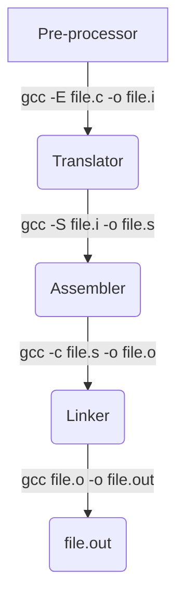

# Linux: Embedded development

------

## Introduction to Linux 

------

### Definition:

- Linux is a member of the UNIX family of operating systems.
- Precisely speaking, the term Linux refers just to the kernel developed by Linus Torvalds and others. However, the term Linux is commonly used to mean the kernel, plus a wide range of other software (tools and libraries) that together make a complete operating system. 

###  History:

- Unix (1969)
  - The UNIX system was first implemented in 1969 on a Digital PDP-7 minicomputer by Ken Thompson at Bell Laboratories (part of AT&T). The operating system drew many ideas, as well as its punned name, from the earlier MULTICS system. By
    1973, UNIX had been moved to the PDP-11 mini-computer and rewritten in C, a programming language designed and implemented at Bell Laboratories by Dennis Ritchie. Legally prevented from selling UNIX, AT&T instead distributed the complete system to universities for a nominal charge. This distribution included source code, and became very popular within universities, since it provided a cheap operating system whose code could be studied and modified by computer science academics and students.

- The GNU Project (1984)

  - In 1984, Richard Stallman, an exceptionally talented programmer who had been working at MIT, set to work on creating a “free” UNIX implementation.
  -  In 1985, Stallman founded the Free Software Foundation (FSF), a non-profit organization to support the GNU project as well as the development of free software in general.
  - One of the important results of the GNU project was the development of the GNU General Public License (GPL), the legal embodiment of Stallman’s notion of free software.																	

- The Linux Kernel (1991):

  

  - In 1991, Linus Torvalds, a Finnish student at the University of Helsinki, was inspired to write an operating system for his Intel 80386 PC.
  - Inspired by Minix, a small UNIX-like operating system kernel Torvalds started on a project to create an efficient, full-featured UNIX kernel to run on the 386. Over a few months, Torvalds developed a basic kernel that allowed him to compile and run various GNU programs. Then, on
    October 5, 1991, Torvalds requested the help of other programmers, making the following now much-quoted announcement of version 0.02 of his kernel in the comp.os.minix
  - Like most free software projects, Linux follows a release-early, release-often model, so that new kernel revisions appear frequently (sometimes even daily). As the Linux user base increased, the release model was adapted to decrease disruption to existing users. Specifically, following the release of Linux 1.0, the kernel developers adopted a kernel version numbering scheme with each release numbered x.y.z: x representing a major version, y a minor version within that major version, and z a revision of the minor version (minor improvements and bug fixes).
  - As a general goal, Linux (i.e., kernel, glibc, and tool) development aims to conform to the various UNIX standards, especially POSIX and the Single UNIX Specification.


### Man page Section Numbers

- 2 for system API   eg: man 2 open

- 3 for Library Functions  eg: man 3 fopen

- 7 for Subsystems and kernel components  eg: man 7 tcp

- run `man man` to know more about the man sections

  

### C compilation 




- Understanding translation would lead to writing more efficient programming.
- `Objdump -D` (Dis assembler all flag) is used to display the information from the object files
  - `objdump -x` to see all header info
  - `objdump --disassemble` to generate assembly code from the object file
- `ldd` is a tool used to print shared object dependencies
- `-v` (verbose) can be used to display more insights
  - eg: `gcc -E -v a.c -o a.i`
- 
- GCC initially runs con-fig script which verifies dependencies
- cc1 is the tool for compiling and pre-processing 
- Compilation involves pre processor, translator and assembler.
- Build involves linking.
- Binary are two types **Relocatable** Binary and **Executable** Binary.
- In UNIX/Linux the preferred binary format is **ELF**
  - **[Executable and Linkable Format PDF](./PDFs/ELF_Format.pdf)**
- In Windows the preferred binary format is **COFF**
- GCC on windows has different assembler and linker to generate coff
- we can take a `app.s` file (assembly file) generated in Linux and use it to generate a executable in windows
- Relocatable binary only has address offsets, linker **assigns** load addresses to object file (instruction relocation, procedure relocation and function call relocation)
- Linker appends run time routines \ bootstrap code. optionally resolving library call relocation
- Run time code **initialises** the heap section and stack section.
- Run time code also provides command line arguments to main `_start`(constructor) `_fini` (destructor)
- Run time code is always OS specific
- [How main in executed in Linux](https://linuxgazette.net/issue84/hawk.html)


### Application Binary Interface (ABI)

- An application binary interface (ABI) is a set of rules specifying how a binary executable should exchange information with some service (e.g., the kernel or a library) at run time. Among other things, an ABI specifies which registers and stack locations are used to exchange this information, and what meaning is attached to the exchanged values. Once compiled for a particular ABI, a binary executable should be able to run on any system presenting the same ABI.

- ABI are provided by Linux/UNIX both have ABI standard as System V 

  - Run time standard is system V (5)  [Link](https://www.sco.com/developers/gabi/latest/contents.html)

  - ##### ABI for the Arm 64-bit Architecture

    - Procedure Call Standard for the Arm 64-bit Architecture - [pdf](https://github.com/ARM-software/abi-aa/releases/download/2025Q1/aapcs64.pdf), [html](https://github.com/ARM-software/abi-aa/blob/c51addc3dc03e73a016a1e4edf25440bcac76431/aapcs64/aapcs64.rst)
    
    - ELF for the Arm 64-bit Architecture - [pdf](https://github.com/ARM-software/abi-aa/releases/download/2025Q1/aaelf64.pdf), [html](https://github.com/ARM-software/abi-aa/blob/c51addc3dc03e73a016a1e4edf25440bcac76431/aaelf64/aaelf64.rst)
    
    - DWARF for the Arm 64-bit Architecture - [pdf](https://github.com/ARM-software/abi-aa/releases/download/2025Q1/aadwarf64.pdf), [html](https://github.com/ARM-software/abi-aa/blob/c51addc3dc03e73a016a1e4edf25440bcac76431/aadwarf64/aadwarf64.rst)
    
    - C++ ABI for the Arm 64-bit Architecture - [pdf](https://github.com/ARM-software/abi-aa/releases/download/2025Q1/cppabi64.pdf), [html](https://github.com/ARM-software/abi-aa/blob/c51addc3dc03e73a016a1e4edf25440bcac76431/cppabi64/cppabi64.rst)
    
    - Vector Function ABI for the Arm 64-bit Architecture - [pdf](https://github.com/ARM-software/abi-aa/releases/download/2025Q1/vfabia64.pdf), [html](https://github.com/ARM-software/abi-aa/blob/c51addc3dc03e73a016a1e4edf25440bcac76431/vfabia64/vfabia64.rst)
    
    - PAuth ABI Extension to ELF for the Arm 64-bit Architecture - [pdf](https://github.com/ARM-software/abi-aa/releases/download/2025Q1/pauthabielf64.pdf), [html](https://github.com/ARM-software/abi-aa/blob/c51addc3dc03e73a016a1e4edf25440bcac76431/pauthabielf64/pauthabielf64.rst)
    
    - System V ABI for the Arm 64-bit Architecture - [pdf](https://github.com/ARM-software/abi-aa/releases/download/2025Q1/sysvabi64.pdf), [html](https://github.com/ARM-software/abi-aa/blob/c51addc3dc03e73a016a1e4edf25440bcac76431/sysvabi64/sysvabi64.rst)
    
    - Memtag Extension to ELF for the Arm 64-bit Architecture - [pdf](https://github.com/ARM-software/abi-aa/releases/download/2025Q1/memtagabielf64.pdf), [html](https://github.com/ARM-software/abi-aa/blob/c51addc3dc03e73a016a1e4edf25440bcac76431/memtagabielf64/memtagabielf64.rst)
    
    - C/C++ Atomics Application Binary Interface Standard for the Arm 64-bit Architecture - [pdf](https://github.com/ARM-software/abi-aa/releases/download/2025Q1/atomicsabi64.pdf), [html](https://github.com/ARM-software/abi-aa/blob/c51addc3dc03e73a016a1e4edf25440bcac76431/atomicsabi64/atomicsabi64.rst)
    
      
    
  - ##### ABI for the X86 Architecture
  
    - System V Application Binary Interface **AMD64** Architecture Processor Supplement - [ABI AMD64](https://cs61.seas.harvard.edu/site/2022/pdf/x86-64-abi-20210928.pdf )
    - System V Application Binary Interface **Intel386** Architecture Processor Supplement - [ABI Intel386](https://www.uclibc.org/docs/psABI-i386.pdf)

### Startup Initializer Subsystem

- Bios or boot loader are responsible to load Kernel into user space

- Core startup initializer subsystems:  Run during system startup are responsible for system init.

  - Architecture specific/ kernel bsp / HAL code, does i/o initialization.
  - In Kernel : Takes care of  boot up activities, calibration and core data structure initialization of Data structures of interrupt tables, paging tables, Device tables.
  - Initializes service subsystem and loader, Loader then initializes UI (interactive or non interactive).

- Service subsystem is responsible for allocation and deallocation of resources to user apps during run-time.

  

### OS types

- General Purpose OS: They have a lot of services to accommodate different user application
- Embedded OS: Here the number of services modules are limited to suit applications which are few in number
  - Designed for specific embedded platforms.
- Real time OS: Kernel designed with deterministic services that guarantee fixed time response under any load configuration.

### Kernel types


- Monolithic kernel : 3rd party driver can corrupt kernel space in monolithic kernel.
  - In monolithic kernel user application accessing kernel space termination with segmentation fault.
- Micro Kernel : To tackle this issue in Micro kernel a separate space for 3rd party drivers is created.
  - Micro kernel cannot be a distribution as drivers are to be a part of the user space
- MMU is used to enforce the protection MMU shall inform the CPU that the user app is trying to access the kernel space and will inform the kernel

|                           | Micro Kernel                                                 | Monolithic Kernel                                            |
| ------------------------- | ------------------------------------------------------------ | ------------------------------------------------------------ |
| **Size**                  | Smaller                                                      | Larger as OS and both user lie in the same address space.    |
| **Execution**             | Slower                                                       | Faster                                                       |
| **Extendable**            | Easily extendable                                            | Complex to extend                                            |
| **Security**              | If the service crashes then there is no effect on working on the micro kernel. | If the process/service crashes, the whole system crashes as both user and OS were in the same address space. |
| **Code**                  | More code is required to write a micro kernel.               | Less code is required to write a monolithic kernel.          |
| **Examples**              | L4Linux, macOS                                               | Windows, Linux BSD                                           |
| **Security**              | More secure because only essential services run in kernel mode | Susceptible to security vulnerabilities due to the amount of code running in kernel mode |
| **Platform independence** | More portable because most drivers and services run in user space | Less portable due to direct hardware access                  |
| **Communication**         | Message passing between user-space servers                   | Direct function calls within Kernel                          |
| **Performance**           | Lower due to message passing and more overhead               | High due to direct function calls and less overhead          |


### Static and dynamic linkage

- Libraries can be linked either statically or dynamically, If a library is integrated into  the application binary during image during build time it is referred to as static linking.

- Libraries compatible with static linking must be files with a `.a`extension

- If a library is linked with an app binary in memory then it is referred to as dynamic linkage.

- For a library to be compatible with dynamic linking it must be built as per **API** standards of the platform

- Dynamic libraries in Linux are identified by `.so` extension

  #### Creating Library images

  - 

  - ##### Static library creation

    - Implement library  sources
    - Compile source into relocatable binaries 
      - eg: `gcc -c one.c -o one.o, gcc -c two.c -o two.o`
    - Create a library image using archive tool (ar) 
      - eg: `ar -rcs libtest.a one.o two.o`
      - use `nm -s libtest.a` to look into the symbol list, 
    - If crash location is known we can use symbol data to identify the function where crash occurred.
    - **strip** is a tool to discard symbol table

    

  - **Dynamic Library creation**

    - Implement library sources
    - Compile source into position independent code eg: `gcc -c -fPIC one.c` and `gcc -c -fPIC two.c` 
    - As linker is a file which adds ABI compatibility so we use Linker also generate the dynamic library.
      - eg:`gcc -shared -o libtest.so one.o two.o`
    - Standard libraries are looked up linker for linkage and need not be specified while compiling
    - hint use `objdump -sl | more` to know more
    - Linker prepares PLT(procedure Link Table) which maintains a list dynamically
    - In dynamically loaded libraries the function pointers for the library  functions will be updates only when library is loaded  i.e during run-time.
    - Dynamic Linkages are resolved through PLT tables
    - PLT which the linker generates at build time contains references of dynamically linked library functions.
    - Each record of a PLT is a function pointer whose address is referred by the calling instructions in the text segment 
      - eg: `callq 400630 < test@plt>`
    - To confirm an issue with library use the `ldd` tool.

    

    ##### Static Linkage

    - Static linkage appends the library functions into executable's text segment and assign a base address for each.
    - Function call instructions are directly referred to the base address of the function.
      - eg: `callq 4005e1 < test >`

    

    ##### Dynamic  Linkage

    - Dynamic linked applications will have variable initialization lag. In case of static linking there is zero initialization lag.

    - Dynamic linked apps are preferred for complex applications.

      

    **PRO's  of static linkage**

    - Static executable are ready to run as soon as they are loaded (no init is needed).

    - Static executable performs better on resource constrained systems.

      

    **CON's  of static linkage**

    - Static executable are difficult to maintain in the long term.

    - Static executable performs better on resource constrained systems.

      

    **PRO's  of dynamic linkage**

    - Dynamic builds are modular, extensible and adaptable which enables easier long term maintenance.

    - Dynamic builds can share a library image across n application which help optimal utilisation of memory in multi taking environment.

      

    **CON's  of dynamic linkage**

    - Dynamic linkage involves updating PLT records of the application which is variable time operation and results in initialization lag.
    - Dynamic linkages requires OS to support a run time library manager to be always present in memory(link-loader).

### Loader and Process Manager

- `ld` is a tool to invoke linker only.

- when command is sent to shell for execution shall check.
  - Is file present
  - Is file executable 
  - Is the file image format compatible

Every object file has the following components

1. Header (metadata)
2. Image

- We can use `readelf - a ./app` to look into the header of the app.
- segmentation table of  the header contains information about organization of image.
- loader uses header(segmentation table) to allocate space for stat and code section.
- Note: Code segment is not necessarily contiguous.
- Process Manager:
  - It will instantiate the PCB(Process Control Block) and Initialize it.
  - PCB gets added to the run/ready que of the scheduler.


- Process is a program in memory that is registered with the kernel
- PCB in Linux is an instance of task structure struct task_struct
  - cat /proc/< Process ID >/maps | more to see the program organisation


### Types of Dynamic Linkage

- Dynamic Linkage is of two types 
  1. Load time linking
  2. Run time Linking 

- Dynamic libraries can be linked into a process address space either at load time(dynamic process initialization) or run-time

- load-time linkage is default if application is not programmed for run-time linkage.

- Shared objects linked at load-time remains in the address space of the process until termination.

- A Process can link .so whenever it is needed and un-link it when it is not longer needed if the process OS is designed to support run-time linkage.

- eg: `gcc mandl.c -o mandl -ldl`

- `dlopen` function requires one of the below value as an argument flag:

  - `RTLD_NOW` : If this value is specified, or the environment variable `LD_BIND_NOW` is set to a nonempty string, all undefined symbols in the shared object  are  resolved before `dlopen()` returns. If this cannot be done, an error is returned.
  - `RTLD_LAZY` : Perform lazy binding.  Resolve symbols only as the code that references them is executed.  If the symbol is never referenced, then it is  never  resolved.(Lazy  binding  is  performed only for function references; references to variables are always immediately bound when the shared object is loaded.) 
  - `RTLD_DEEPBIND` : Place the lookup scope of the symbols in this shared object ahead of the global scope. This means that a self-contained object will use its  own  symbols in preference to global symbols with the same name contained in objects that have already been loaded.

- The following code is an example of dynamic linkage during run-time:

  **test.c**	

  ```c
  #include <stdio.h>
  
  void testfn(){
  		printf("printing from test function in libtest.so\n");
          }
  ```

  

  **main.c**

  ```c
  #include <stdio.h>
  #include <dlfcn.h>
  #include <stdlib.h>
  
  int main (void){
      
      void * handle;
      
      /* STEP1: Declare a function pointer */
      void (*fnptr) (void);
      printf("%s: start of main\n",__func__);
      
      /* STEP2: Request link loader to load specific library and attach it to the address space */
      handle = dlopen("./libtest.so", RTLD_NOW);
      if (handle == NULL)
      {
          printf("Failed to load library libtest.so\n");
          exit(2);
      }
      
      /* STEP3: lookup for the address of the required function */
      dlerror(); // clear all dl errors
      fnptr = dlsym(handle, "testfn");
      if (dlerror() != NULL)
       {
  		printf("Unable to load function test from libtest.so\n");
          exit(2);
       }
  
      /* STEP4: Invoke the function trough the pointer */
      (fnptr)();
      
      /* STEP5: Request link loader to unlink specific library from the address space */
      dlclose(handle);
  }
  ```

  

#### Steps to compiling the above program

1. Generate position independent code of library source 

   - eg: `gcc -c -Wall -Werror -fpic test.c -o test.o`

2. Turn the library object file into a shared library. 

   - eg: `gcc -shared -o libtest.so test.o`

3. Compile main program which uses the libtest.so functions,  `-L`  specifies the location of library to **linker** and in order to request  linking `libtest` we will be providing the argument `-ltest`

   -  Run    `gcc -L <path_of_library_so_file> -Wall -o main.out main.c -ltest`

4. Export the library path using `export LD_LIBRARY_PATH=<LIBRARY_PATH>`  we need to do this as the library is not part of standard path like `/usr/lib`     hence **loader** will look up any patch mentioned in  `LD_LIBRARY_PATH`

5. run ./main.out and the output should be as below: 

   > main: start of main 
   > printing from test function in libtest.so

6. You can run the following command to know the location of the library `ldd main.out | grep test`

7. Instead of specifying library path every time you want to compile or execute the program in a new shell we can add the library in a well known path  

   ```bash
   $ cp <library_path>/libtest.so /usr/lib
   $ chmod 0755 /usr/lib/libtest.so
   ```


#### Library Dependencies

- Create a shared object `libdrv.so` with following functions

  **drv.c**

  ```c
  #include <stdio.h>
  
  void x(void){
  		printf("\n %s \n", __func__);
      	a();
  }
  
  void y(void){
  		printf("\n %s \n", __func__);
  		b();
  }
  ```

- Create a shared object from drv.c source file 

  - generate library object file: `gcc -c -fpic drv.c -o drv.o`
  - Generate `.so` from object file `gcc -shared -o libdrv.so drv.o`

  

- Create a dependency library libdep.so with following functions

  **dep.c**

  ```c
  #include <stdio.h>
  
  void a(void){
  		printf("\n %s \n", __func__);
  }
  
  void b(void){
  		printf("\n %s \n", __func__);
  }
  ```

  **dep.h**

  ```c
  void a(void);                                                                                                                 void b(void);
  ```

  

- Build instructions

  - Generate object file from library source file 
    - `gcc -c -fpic drv.c drv.o`
    - `gcc -c -fpic dep.c dep.o`
  - Generate object file from main file
    - `gcc -c drv_main.c -o drv_main.o` 
  - Generate shared library from object file 
    - `gcc -shared -o libdep.so dep.o`
    - `gcc -shared -o libdrv.so drv.o`
  - Link both file`gcc -L=. -Wall -o drv_main.out drv_main.o -ldrv -ldep`
  - export library path for loader,  `export LD_LIBRARY_PATH=<LIBRARY_PATH>` and run `./drv_main.out`		


### File Systems

- File system is a kernel service which manages files.
- Files are of 2 types:
  1. Storage File System 
  2. Logical File System\
- Run `cat /proc/filesystems` to see all the file systems supported in your GNU/Linux OS'
  - `nodev` - represents logical file system
- proc is also a logical file system the file in proc are stored in primary memory
  - `cat /proc/meminfo`
  - refer `man 5 proc` for additional info
- The proc filesystem is a pseudo-filesystem which provides an interface to kernel data structures.  It is commonly mounted at /proc.
  - `man dl` for more info on `dl`


### Virtual Address Space:

- CPU are configured to access a memory location through a memory controller.

- memory controller accesses memory for the CPU.

  

- Size of memory access is dependent on the size of address bus, with a 32 bit wide address bus 4GB of data can be accessed.

- Memory controller is responsible for carrying out physical access operations on memory as per control instruction received on the control bus.

- Memory controller falls back on address decoding circuit for resolving physical memory location corresponding to address specified by the CPU.

- Address decoders are HW programmed with an address map that assign addresses to various memory components (RAM, ROM, Device Registers).

- SW programs must be built and deployed into ram  using appropriate linker scripts to ensure unique address space for each program.

- As number of program to be deployed increases the complexity of assigning unique address spaces for each build and ensuring that programs don't overlap with memory increases.

- To enable systems to support deployment of increased no of programs without assigning unique address space at build time CPU's with  MMU virtual addresses and protected mode operations are used.

- Program built with a common virtual address & deployed into memory trough a system software (OS).

- System software is an OS with memory management capabilities/

- OS ensures mapping of each program image to unique physical memory and generates a table of address translations which contains build time virtual addresses to physical address mapping  information (Page Table).

- During program execution CPU's are configured to access address translation table for determining physical location of program data and instructions.

- CPU with additional circuit called MMU can only perform virtual to physical address translation.

- #### Kernel space and User space

  - Virtual memory is split into two regions to achieve separation of kernel from applications. linker scripts enforce this separation during build time.

  -  A range of address are reserved for kernel build called kernel space and another range of address are reserved to support user application is called user space.

  - On 32 bit systems with 4GB of address space default configuration splits in 3:1 ratio 0 to 3GB for app build , 3 to 4 GB(1GB) for kernel space, kernel linker script is present in kernel space.

    

### Stack Segment

- Stack is a segment of virtual address space which is mapped to a physical memory where local data of the procedures currently in execution is stored.

- Each procedure is assigned a frame with in stack segment each frame is identified with a base and TOP address

- ABI provides rules on how translation must take place

  #### Code Translation

  - Compilers are programmed to translate source code int o appropriate assembly instructions

  - Translation rules are described by ABI standard of the OS, which are programmed in to the compiler.

  - The following translation assumes X86_32 bit Linux platform

  - Each procedure of the source file is translated in the following order

    - Identify non executable statements

    - Resolve all executable statements

    - Translate executable statements into there assembly instructions for the  c program below:

      ```c
      int main()
      {
      	int a = 10;
      	int b = 20;
      	int c;
      	c = a+ b;
      	return 0;
      }
      ```

    - Translator creates a symbol table for variable declaration 

      | Symbol Name | Type | Composition | offset address |
      | ----------- | ---- | ----------- | -------------- |
      | a           | int  | 4           | -12 (%ebp)     |
      | b           | int  | 4           | -8 (%ebp)      |
      | c           | int  | 4           | -4 (%ebp)      |
      |             |      | Total 12    |                |

      

      ```c
      int main()						//   main:				
      {								//   pushl % ebp       ------> Preanmble
       								//   movl %esp, %ebp   ------> Preanmble
       								//   subl  $12, %esp
       						
      	int a = 10;					//	 movl $10, -12(%esp)  
      	int b = 20;					//   movl $20, -8(%esp)
      	int c;						//   movl -8(%ebp), eax 
      	c = a+ b; // non atomic		//   movl -12(%ebp), %edx
      								//   addl  %edx, %eax
      								//   movl  %eax, -4(%ebp)
      								//   movl  $0, %eax
      	return 0;					//   movl  %ebp, %esp  ---------> leave (postamble)	
      								//   popl  %ebp        ---------> exit (postamble)	
      }
      ```

      ###### Execution Trace:

      -  CPU registers:
        - ebp  96
        - esp   84 
        - eax    0
        - edx    10
      - Stack segment:
        - Value      ADDR
        - 132  <---  96
        - 30    <---   92 --> c
        - 20    <---   88 --> b
        - 10    <---   84 --> a

  - ##### Translating a function call

    ```c
    void swap(int x, int y){
    	
        int tmp;
    	
        tmp = x;
    	x = y;
    	y = temp;
    }
    
    int main (){
    
        int a,b;
    	
        a = 10;
    	b = 20;
        swap(a,b);
    	return 0;
    }
    ```

    

    - Function call translation depends on function calling convention specified by ABI standard. Linux 32 bit x86 systems use c- calling convention as a default standard for x86 64 bit system on Linux standard call convention is default calling convention.

    - The following are the steps involved as per 32 bit calling conventions.

      1. Push each argument onto top of the stack starting with right most argument.
      2. Invoke called function.
      3. Gather return value of the called function from the eax accumulator.
      4.  Release memory allocated for arguments.

      ```c
      int main (){							//	main:
      										//		pushl % ebp
          int a,b;							//		movl  % esp, ebp
      										// 		subl  $8 , %ebp
          a = 10;								//		movl  $10, -8 (%ebp)
      	b = 20;								//		movl  $20, -4 (%ebp)
          swap(a,b);							//		pushl -4 (%ebp)
      	return 0;							//		pushl -8 (%ebp)
          									//		call sleep
          									//		addl $8 , %esp ;deallocating stack space for argument
          									//		movl $0, %eax
          									//		movl %ebp, %esp ; leave
          									//		popl %ebp		; return
      }
      ```

      ```c
      void swap(int x, int y){				//	swap:
      										//		pushl	%ebp
          int tmp;							//		movl	%esp, ebp
      										//		subl	$4, %esp
          tmp = x;							//		movl	8(%ebp), %eax
      	x = y;								//		movl	%eax, -4(%ebp)
      	y = temp;							//		movl	12(%ebp), %eax
          									//		movl	%eax, 12(%ebp)
          									//		movl	-4 (%ebp), %eax
          									//		movl	%eax, 12(%ebp)
          									//		movl %ebp, %esp ; leave
          									//		popl %ebp		; return
      }
      ```

      ###### Execution Trace:

      -  CPU registers:

        | Register Name | Register Value |
        | ------------- | -------------- |
        | ebp           | 172            |
        | esp           | 168            |
        | eax           | 10             |
        | eip           | 2000           |

        

      - Stack segment:

        | Value at Address      | Stack Address |
        | --------------------- | ------------- |
        | 232                   | 196           |
        | 20                    | 192           |
        | 10                    | 188           |
        | 20                    | 184           |
        | 10                    | 180           |
        | 1008 (return address) | 176           |
        | 196                   | 172           |
        | 10                    | 168           |

        

    -  `gcov`  is a great tools to understand code coverage and `gprof` can be used to see call graph and understand the compute time

  #### x86_64 calling convention for Linux

  - Call convention for 64 bit requires first 6 arguments to be passed through CPU accumulators, arguments beyond 6 are passed through the caller stack frame as per the ABI the following are accumulators reserved for arguments.
    - `rdi`
    - `rsi`
    - `rdx`
    - `rcx`
    - `r8`
    - `r9`
  - return value are to be moved into `rax` register.

### Invoking System calls:

System calls are functions in kernel code segment through which a user mode application can step into a kernel service.

Invoking a system call requires processor to jump from user mode address space of the process into kernel mode.

Local data of the system call and stack frames of the functions invoked by system call are allocated in kernel mode stack of the process.

TODO: add diagram 

ABI standard define system call invocation procedure.

#### 32 bit x86 system call invocation:

1. Move system call identifier into eax accumulator.

2. Starting with right most argument move each parameter onto the CPU accumulator.

   - For 64 bit `rdi` , `rsi`, ` rdx` , `r10`, `r8`, `r9` 
   - For 32 bit `edi`

3. Trigger an software interrupt on Trap vector 

   - for 32 bit  int $0x80
   - for 64 bit syscall

4. To gather return value of a system call read from `eax` (32 bit) or `rax` (64 bit).

   ```c
   #include <stdio.h>
   
   int main(){
       int res;
       __asm__("movl $338, %eax");
       __asm__("int $0x80");
       __asm__("movl %eax, -4(%ebp)");
       printf("val returned by Syscall %d\n", res);
       return 0;
   }
   ```

Refer Geek for Geek tutorial : https://www.geeksforgeeks.org/introduction-of-system-call/

To facilitate invocation of system call through high level language source OS vendors provide a library of functions called API (Application Program Interface).

API is a function programmed to invoke a system call, it is an abstraction of assembly instructions required to invoke system calls.

Since API's are OS specific any application programmed to invoke an API would not be portable.

Linux System call path

- User Space

| Application          | Application | Application | Application |
| -------------------- | ----------- | ----------- | ----------- |
| **Library Language** | **Printf**  | **Malloc**  | **Fwrite**  |
| **API**              | **Write**   | **brk**     | **Write**   |

- Kernel Space

| System call        | sys_write  | sys_brk          | sys_write  |
| ------------------ | ---------- | ---------------- | ---------- |
| **Kernel service** | **Driver** | **Buddy System** | **Driver** |


### Heap Allocations:

-  Heap is a segment of reserved virtual address used for run-time memory allocations.

- Kernel memory manager keeps track of heap segment of heap segment of a process through memory descriptor structure (struct mm_struct).

- PCB of the process contains reference to memory descriptor.

- **Program brk** and **Start brk** are elements of memory descriptor which refer to heap address space.

- Start brk refers to the start address of the heap and Program brk refers to the top of the heap.

- In the beginning of the program  Start brk and Program brk point to the same address location.

- Increasing the program break has the effect of allocating memory to the process while decreasing the break deallocates memory.

- `brk()` and `sbrk()` change the location of the program break.

  - `int brk(void *addr);`
  - `void *sbrk(intptr_t increment);`

- Program to show how to use brk and sbrk

  ```c
  #include <stdio.h>
    #include <unistd.h>
    
    int main(void){
        void *curr_brk, *def_brk, *new_brk;                                                                                                                                                    
        /* Grab current program break address */
        curr_brk = sbrk(0);
        def_brk  = curr_brk;
        printf("\ncurrent_brk= %p \n", curr_brk);
        getchar();
        /* Change the location the program break using brk(allocate 100 bytes of heap) */
        brk(curr_brk + 100);
        /* verify change */
        new_brk = sbrk(0);
        printf("new_brk= %p\n",new_brk);
        /* Restore default location of the program break */
        brk(def_brk);
    }
  ```

  

  #### Malloc and Free

  - C Library and other high level languages libraries implement heap management algorithms these algorithm are designed to provide easier access to heap memory and random allocation and deallocation.

  - Heap management algorithm provide 2 categories of function interfaces

    1.  Allocation & deallocation calls (`malloc` , `calloc`, `realloc`)
    2. Configuration and setup (`mallopt`, `malloc_start`, `malloc_info`)

  - glibc heap allocation algorithm is programmed with the following configuration:

    - An allocation request of 128 Kb or less is considered small block and is always allocated from heap segment

    - heap is always allocated in multiples of 128 Kb.

    - An allocation request greater than 128 Kb are considered large and such blocks are setup from `mmap` region of the address space.

    - Allocation for `mmap` are always released back to system when they are freed by the application.

    - `mmap` is the API used for `mmap` allocation by `malloc`.

    - Default configurations can be altered for a specific program using `mallopt`

      -  `int mallopt (int param, int value);`

    - The `mallopt()` function adjusts parameters that control the behaviour of the memory allocations.

    - The following are allocation related parameters

      - `M_MMAP_MAX`: This parameter specifies the maximum number of allocations requests that may be simultaneously served using `mmap`. setting this parameter to Zero disables the use of `mmap`, i.e disables `mmap` for servicing large allocation requests.

      - `M_MMAP_THRESHOLD`: For allocations greater than or equal to the limit specified (in bytes) by `M_MMAP_THRESHOLD` that can't be satisfied from the free list, the memory-allocation functions employ `mmap(2)` instead of increasing the program break using sbrk(2)

      - `M_TOP_PAD`: This parameter defines the amount of padding to employ when calling sbrk(2) to modify the program break.

        - When the program break is increased , then `M_TOP_PAD`  bytes are added to the sbrk(2) request.

        - Modifying `M_TOP_PAD`  is a trade off between increase the number of system call (when the parameter is set low) and wasting unused memory at the top of the heap(when the param is set high)

        - In either case, the amount of padding is always rounded to a system boundary 

          - eg: `mallopt(M_TOP_PAD , 0);`

          - eg: `mallopt(M_MMAP_THRESHOLD , 0);`

          - Source: `linuxpro/memalloc/part4/mallopt.c`

            ```c
            #include <stdio.h>
            #include <string.h>
            #include <malloc.h>
            
            int main()
            {
            	int i =100;
            	void *p, *p1;
            
            	mallopt(M_TOP_PAD, 0);
            	mallopt(M_MMAP_THRESHOLD, 4096);		
            	malloc_stats();
            	getchar();
            
            	p = (void *)malloc(4096 * 2);
            	malloc_stats();
            	getchar();
            
            	free(p);
            	malloc_stats();
            	getchar();
            
            	p1 = (void *)malloc(1024);
            	malloc_stats();
            	getchar();
            
            	free(p1);
            	malloc_stats();
            	getchar();
            
            	p = (void *)malloc(4096 * 2);
            	malloc_stats();
            	getchar();
            
            	free(p);
            	malloc_stats();
            	getchar();
            	return 0;
            }
            ```

            

