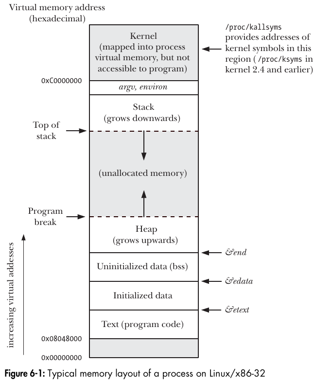
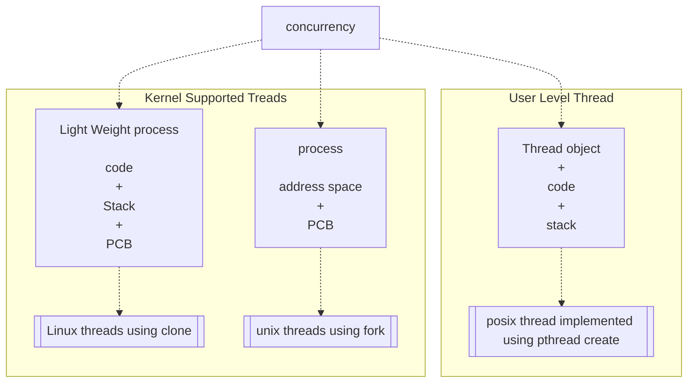

# Linux: Embedded development

------

### Introduction to Linux 

------

- Linux is a member of the UNIX family of operating systems.
- Precisely speaking, the term Linux refers just to the kernel developed by Linus Torvalds and others. However, the term Linux is commonly used to mean the kernel, plus a wide range of other software (tools and libraries) that together make a complete operating system. 

####  History:

- Unix (1969)
  - The UNIX system was first implemented in 1969 on a Digital PDP-7 minicomputer by Ken Thompson at Bell Laboratories (part of AT&T). The operating system drew many ideas, as well as its punned name, from the earlier MULTICS system. By
    1973, UNIX had been moved to the PDP-11 mini-computer and rewritten in C, a programming language designed and implemented at Bell Laboratories by Dennis Ritchie. Legally prevented from selling UNIX, AT&T instead distributed the complete system to universities for a nominal charge. This distribution included source code, and became very popular within universities, since it provided a cheap operating system whose code could be studied and modified by computer science academics and students.

- The GNU Project (1984)

  - In 1984, Richard Stallman, an exceptionally talented programmer who had been working at MIT, set to work on creating a “free” UNIX implementation.
  -  In 1985, Stallman founded the Free Software Foundation (FSF), a non-profit organization to support the GNU project as well as the development of free software in general.
  - One of the important results of the GNU project was the development of the GNU General Public License (GPL), the legal embodiment of Stallman’s notion of free software.																	

- The Linux Kernel (1991):

  

  - In 1991, Linus Torvalds, a Finnish student at the University of Helsinki, was inspired to write an operating system for his Intel 80386 PC.
  - Inspired by `Minix`, a small UNIX-like operating system kernel Torvalds started on a project to create an efficient, full-featured UNIX kernel to run on the 386. Over a few months, Torvalds developed a basic kernel that allowed him to compile and run various GNU programs. Then, on
    October 5, 1991, Torvalds requested the help of other programmers, making the following now much-quoted announcement of version 0.02 of his kernel in the comp.os.minix
  - Like most free software projects, Linux follows a release-early, release-often model, so that new kernel revisions appear frequently (sometimes even daily). As the Linux user base increased, the release model was adapted to decrease disruption to existing users. Specifically, following the release of Linux 1.0, the kernel developers adopted a kernel version numbering scheme with each release numbered `x.y.z: x` representing a major version, y a minor version within that major version, and z a revision of the minor version (minor improvements and bug fixes).
  - As a general goal, Linux (i.e., kernel, `glibc`, and tool) development aims to conform to the various UNIX standards, especially POSIX and the Single UNIX Specification.


### Man page Section Numbers

- 2 for system API   eg: `man 2 open`

- 3 for Library Functions  eg: `man 3 fopen`

- 7 for Subsystems and kernel components  eg: `man 7 tcp`

- run `man man` to know more about the man sections

  

### C compilation 

```mermaid
	graph TD
    A[Pre-processor] 
    B(Translator)
    C(Assembler)
    D(Linker)
    E(file.out)
    subgraph	
	A-- gcc -E file.c -o file.i -->B -- gcc -S file.i -o file.s --> C-- gcc -c file.s -o file.o -->D -- gcc file.o -o file.out -->E
	end

```


- Understanding translation would lead to writing more efficient programming.
- `Objdump -D` (Dis assembler all flag) is used to display the information from the object files
  - `objdump -x` to see all header info
  - `objdump --disassemble` to generate assembly code from the object file
- `ldd` is a tool used to print shared object dependencies
- `-v` (verbose) can be used to display more insights
  - eg: `gcc -E -v a.c -o a.i`
- 
- GCC initially runs con-fig script which verifies dependencies
- `cc1` is the tool for compiling and pre-processing 
- Compilation involves pre processor, translator and assembler.
- Build involves linking.
- Binary are two types **Relocatable** Binary and **Executable** Binary.
- In UNIX/Linux the preferred binary format is **ELF**
  - **[Executable and Linkable Format PDF](./PDFs/ELF_Format.pdf)**
- In Windows the preferred binary format is **`COFF`**
- GCC on windows has different assembler and linker to generate `coff`
- we can take a `app.s` file (assembly file) generated in Linux and use it to generate a executable in windows
- Relocatable binary only has address offsets, linker **assigns** load addresses to object file (instruction relocation, procedure relocation and function call relocation)
- Linker appends run time routines \ bootstrap code. optionally resolving library call relocation
- Run time code **initializes** the heap section and stack section.
- Run time code also provides command line arguments to main `_start`(constructor) `_fini` (destructor)
- Run time code is always OS specific
- [How main in executed in Linux](https://linuxgazette.net/issue84/hawk.html)


### Application Binary Interface (ABI)

- An application binary interface (ABI) is a set of rules specifying how a binary executable should exchange information with some service (eg, the kernel or a library) at run time. Among other things, an ABI specifies which registers and stack locations are used to exchange this information, and what meaning is attached to the exchanged values. Once compiled for a particular ABI, a binary executable should be able to run on any system presenting the same ABI.

- ABI are provided by Linux/UNIX both have ABI standard as System V 

  - Run time standard is system V (5)  [Link](https://www.sco.com/developers/gabi/latest/contents.html)

  - ##### ABI for the Arm 64-bit Architecture

    - Procedure Call Standard for the Arm 64-bit Architecture - [pdf](https://github.com/ARM-software/abi-aa/releases/download/2025Q1/aapcs64.pdf), [html](https://github.com/ARM-software/abi-aa/blob/c51addc3dc03e73a016a1e4edf25440bcac76431/aapcs64/aapcs64.rst)
    
    - ELF for the Arm 64-bit Architecture - [pdf](https://github.com/ARM-software/abi-aa/releases/download/2025Q1/aaelf64.pdf), [html](https://github.com/ARM-software/abi-aa/blob/c51addc3dc03e73a016a1e4edf25440bcac76431/aaelf64/aaelf64.rst)
    
    - DWARF for the Arm 64-bit Architecture - [pdf](https://github.com/ARM-software/abi-aa/releases/download/2025Q1/aadwarf64.pdf), [html](https://github.com/ARM-software/abi-aa/blob/c51addc3dc03e73a016a1e4edf25440bcac76431/aadwarf64/aadwarf64.rst)
    
    - C++ ABI for the Arm 64-bit Architecture - [pdf](https://github.com/ARM-software/abi-aa/releases/download/2025Q1/cppabi64.pdf), [html](https://github.com/ARM-software/abi-aa/blob/c51addc3dc03e73a016a1e4edf25440bcac76431/cppabi64/cppabi64.rst)
    
    - Vector Function ABI for the Arm 64-bit Architecture - [pdf](https://github.com/ARM-software/abi-aa/releases/download/2025Q1/vfabia64.pdf), [html](https://github.com/ARM-software/abi-aa/blob/c51addc3dc03e73a016a1e4edf25440bcac76431/vfabia64/vfabia64.rst)
    
    - PAuth ABI Extension to ELF for the Arm 64-bit Architecture - [pdf](https://github.com/ARM-software/abi-aa/releases/download/2025Q1/pauthabielf64.pdf), [html](https://github.com/ARM-software/abi-aa/blob/c51addc3dc03e73a016a1e4edf25440bcac76431/pauthabielf64/pauthabielf64.rst)
    
    - System V ABI for the Arm 64-bit Architecture - [pdf](https://github.com/ARM-software/abi-aa/releases/download/2025Q1/sysvabi64.pdf), [html](https://github.com/ARM-software/abi-aa/blob/c51addc3dc03e73a016a1e4edf25440bcac76431/sysvabi64/sysvabi64.rst)
    
    - Memtag Extension to ELF for the Arm 64-bit Architecture - [pdf](https://github.com/ARM-software/abi-aa/releases/download/2025Q1/memtagabielf64.pdf), [html](https://github.com/ARM-software/abi-aa/blob/c51addc3dc03e73a016a1e4edf25440bcac76431/memtagabielf64/memtagabielf64.rst)
    
    - C/C++ Atomics Application Binary Interface Standard for the Arm 64-bit Architecture - [pdf](https://github.com/ARM-software/abi-aa/releases/download/2025Q1/atomicsabi64.pdf), [html](https://github.com/ARM-software/abi-aa/blob/c51addc3dc03e73a016a1e4edf25440bcac76431/atomicsabi64/atomicsabi64.rst)
    
      
    
  - ##### ABI for the `X86` Architecture
  
    - System V Application Binary Interface **`AMD64`** Architecture Processor Supplement - [ABI AMD64](https://cs61.seas.harvard.edu/site/2022/pdf/x86-64-abi-20210928.pdf )
    - System V Application Binary Interface **`Intel386`** Architecture Processor Supplement - [ABI Intel386](https://www.uclibc.org/docs/psABI-i386.pdf)

### Startup Initializer Subsystem

- BIOS or boot loader are responsible to load Kernel into user space

- Core startup initializer subsystems:  Run during system startup are responsible for system init.

  - Architecture specific/ kernel bsp / HAL code, does i/o initialization.
  - In Kernel : Takes care of  boot up activities, calibration and core data structure initialization of Data structures of interrupt tables, paging tables, Device tables.
  - Initializes service subsystem and loader, Loader then initializes UI (interactive or non interactive).

- Service subsystem is responsible for allocation and deallocation of resources to user apps during run-time.

  

### OS types

- General Purpose OS: They have a lot of services to accommodate different user application
- Embedded OS: Here the number of services modules are limited to suit applications which are few in number
  - Designed for specific embedded platforms.
- Real time OS: Kernel designed with deterministic services that guarantee fixed time response under any load configuration.

### Kernel types


- Monolithic kernel : 3rd party driver can corrupt kernel space in monolithic kernel.
  - In monolithic kernel user application accessing kernel space termination with segmentation fault.
- Micro Kernel : To tackle this issue in Micro kernel a separate space for 3rd party drivers is created.
  - Micro kernel cannot be a distribution as drivers are to be a part of the user space
- MMU is used to enforce the protection MMU shall inform the CPU that the user app is trying to access the kernel space and will inform the kernel

|                           | Micro Kernel                                                 | Monolithic Kernel                                            |
| ------------------------- | ------------------------------------------------------------ | ------------------------------------------------------------ |
| **Size**                  | Smaller                                                      | Larger as OS and both user lie in the same address space.    |
| **Execution**             | Slower                                                       | Faster                                                       |
| **Extend-able**           | Easily extend-able                                           | Complex to extend                                            |
| **Security**              | If the service crashes then there is no effect on working on the micro kernel. | If the process/service crashes, the whole system crashes as both user and OS were in the same address space. |
| **Code**                  | More code is required to write a micro kernel.               | Less code is required to write a monolithic kernel.          |
| **Examples**              | `L4Linux`, `macOS`                                           | Windows, Linux BSD                                           |
| **Security**              | More secure because only essential services run in kernel mode | Susceptible to security vulnerabilities due to the amount of code running in kernel mode |
| **Platform independence** | More portable because most drivers and services run in user space | Less portable due to direct hardware access                  |
| **Communication**         | Message passing between user-space servers                   | Direct function calls within Kernel                          |
| **Performance**           | Lower due to message passing and more overhead               | High due to direct function calls and less overhead          |


### Static and dynamic linkage

- Libraries can be linked either statically or dynamically, If a library is integrated into  the application binary during image during build time it is referred to as static linking.

- Libraries compatible with static linking must be files with a `.a`extension

- If a library is linked with an app binary in memory then it is referred to as dynamic linkage.

- For a library to be compatible with dynamic linking it must be built as per **API** standards of the platform

- Dynamic libraries in Linux are identified by `.so` extension

  #### Creating Library images

  - 

  - ##### Static library creation

    - Implement library  sources
    - Compile source into relocatable binaries 
      - eg: `gcc -c one.c -o one.o, gcc -c two.c -o two.o`
    - Create a library image using archive tool (ar) 
      - eg: `ar -rcs libtest.a one.o two.o`
      - use `nm -s libtest.a` to look into the symbol list, 
    - If crash location is known we can use symbol data to identify the function where crash occurred.
    - **strip** is a tool to discard symbol table

    

  - **Dynamic Library creation**

    - Implement library sources
    - Compile source into position independent code eg: `gcc -c -fPIC one.c` and `gcc -c -fPIC two.c` 
    - As linker is a file which adds ABI compatibility so we use Linker also generate the dynamic library.
      - eg:`gcc -shared -o libtest.so one.o two.o`
    - Standard libraries are looked up linker for linkage and need not be specified while compiling
    - hint use `objdump -sl | more` to know more
    - Linker prepares PLT(procedure Link Table) which maintains a list dynamically
    - In dynamically loaded libraries the function pointers for the library  functions will be updates only when library is loaded  i.e during run-time.
    - Dynamic Linkages are resolved through PLT tables
    - PLT which the linker generates at build time contains references of dynamically linked library functions.
    - Each record of a PLT is a function pointer whose address is referred by the calling instructions in the text segment 
      - eg: `callq 400630 < test@plt>`
    - To confirm an issue with library use the `ldd` tool.

    

    ##### Static Linkage

    - Static linkage appends the library functions into executable's text segment and assign a base address for each.
    - Function call instructions are directly referred to the base address of the function.
      - eg: `callq 4005e1 < test >`

    

    ##### Dynamic  Linkage

    - Dynamic linked applications will have variable initialization lag. In case of static linking there is zero initialization lag.

    - Dynamic linked apps are preferred for complex applications.

      

    **Pro's  of static linkage**

    - Static executable are ready to run as soon as they are loaded (no init is needed).

    - Static executable performs better on resource constrained systems.

      

    **Con's  of static linkage**

    - Static executable are difficult to maintain in the long term.

    - Static executable performs better on resource constrained systems.

      

    **Pro's  of dynamic linkage**

    - Dynamic builds are modular, extensible and adaptable which enables easier long term maintenance.

    - Dynamic builds can share a library image across n application which help optimal utilization of memory in multi taking environment.

      

    **Con's  of dynamic linkage**

    - Dynamic linkage involves updating PLT records of the application which is variable time operation and results in initialization lag.
    - Dynamic linkages requires OS to support a run time library manager to be always present in memory(link-loader).

### Loader and Process Manager

- `ld` is a tool to invoke linker only.

- when command is sent to shell for execution shall check.
  - Is file present
  - Is file executable 
  - Is the file image format compatible

Every object file has the following components

1. Header (meta data)
2. Image

- We can use `readelf - a ./app` to look into the header of the app.
- segmentation table of  the header contains information about organization of image.
- loader uses header(segmentation table) to allocate space for stat and code section.
- Note: Code segment is not necessarily contiguous.
- Process Manager:
  - It will instantiate the PCB(Process Control Block) and Initialize it.
  - PCB gets added to the run/ready que of the scheduler.

```mermaid

graph LR
subgraph	
A[Shell] -->B(Loader) -->C(link-loader) --> D(Process Manager)
end
    %%B --> C{Decision}
    %%C -->|One| D[Result one]
    %%C -->|Two| E[Result two]
```

- Process is a program in memory that is registered with the kernel
- PCB in Linux is an instance of task structure struct task_struct
  - cat /proc/< Process ID >/maps | more to see the program organization


### Types of Dynamic Linkage

- Dynamic Linkage is of two types 
  1. Load time linking
  2. Run time Linking 

- Dynamic libraries can be linked into a process address space either at load time(dynamic process initialization) or run-time

- load-time linkage is default if application is not programmed for run-time linkage.

- Shared objects linked at load-time remains in the address space of the process until termination.

- A Process can link .so whenever it is needed and un-link it when it is not longer needed if the process OS is designed to support run-time linkage.

- eg: `gcc mandl.c -o mandl -ldl`

- `dlopen` function requires one of the below value as an argument flag:

  - `RTLD_NOW` : If this value is specified, or the environment variable `LD_BIND_NOW` is set to a nonempty string, all undefined symbols in the shared object  are  resolved before `dlopen()` returns. If this cannot be done, an error is returned.
  - `RTLD_LAZY` : Perform lazy binding.  Resolve symbols only as the code that references them is executed.  If the symbol is never referenced, then it is  never  resolved.(Lazy  binding  is  performed only for function references; references to variables are always immediately bound when the shared object is loaded.) 
  - `RTLD_DEEPBIND` : Place the lookup scope of the symbols in this shared object ahead of the global scope. This means that a self-contained object will use its  own  symbols in preference to global symbols with the same name contained in objects that have already been loaded.

- The following code is an example of dynamic linkage during run-time:

  **`test.c`**	

  ```c
  #include <stdio.h>
  
  void testfn(){
  		printf("printing from test function in libtest.so\n");
          }
  ```

  

  **main.c**

  ```c
  #include <stdio.h>
  #include <dlfcn.h>
  #include <stdlib.h>
  
  int main (void){
      
      void * handle;
      
      /* STEP1: Declare a function pointer */
      void (*fnptr) (void);
      printf("%s: start of main\n",__func__);
      
      /* STEP2: Request link loader to load specific library and attach it to the address space */
      handle = dlopen("./libtest.so", RTLD_NOW);
      if (handle == NULL)
      {
          printf("Failed to load library libtest.so\n");
          exit(2);
      }
      
      /* STEP3: lookup for the address of the required function */
      dlerror(); // clear all dl errors
      fnptr = dlsym(handle, "testfn");
      if (dlerror() != NULL)
       {
  		printf("Unable to load function test from libtest.so\n");
          exit(2);
       }
  
      /* STEP4: Invoke the function trough the pointer */
      (fnptr)();
      
      /* STEP5: Request link loader to unlink specific library from the address space */
      dlclose(handle);
  }
  ```

  

#### Steps to compiling the above program

1. Generate position independent code of library source 

   - eg: `gcc -c -Wall -Werror -fpic test.c -o test.o`

2. Turn the library object file into a shared library. 

   - eg: `gcc -shared -o libtest.so test.o`

3. Compile main program which uses the `libtest.so` functions,  `-L`  specifies the location of library to **linker** and in order to request  linking `libtest` we will be providing the argument `-ltest`

   -  Run    `gcc -L <path_of_library_so_file> -Wall -o main.out main.c -ltest`

4. Export the library path using `export LD_LIBRARY_PATH=<LIBRARY_PATH>`  we need to do this as the library is not part of standard path like `/usr/lib`     hence **loader** will look up any patch mentioned in  `LD_LIBRARY_PATH`

5. run ./`main.out` and the output should be as below: 

   > main: start of main 
   > printing from test function in `libtest.so`

6. You can run the following command to know the location of the library `ldd main.out | grep test`

7. Instead of specifying library path every time you want to compile or execute the program in a new shell we can add the library in a well known path  

   ```bash
   $ cp <library_path>/libtest.so /usr/lib
   $ chmod 0755 /usr/lib/libtest.so
   ```


#### Library Dependencies

- Create a shared object `libdrv.so` with following functions

  **`drv.c`**

  ```c
  #include <stdio.h>
  
  void x(void){
  		printf("\n %s \n", __func__);
      	a();
  }
  
  void y(void){
  		printf("\n %s \n", __func__);
  		b();
  }
  ```

- Create a shared object from `drv.c` source file 

  - generate library object file: `gcc -c -fpic drv.c -o drv.o`
  - Generate `.so` from object file `gcc -shared -o libdrv.so drv.o`

  

- Create a dependency library `libdep.so` with following functions

  **`dep.c`**

  ```c
  #include <stdio.h>
  
  void a(void){
  		printf("\n %s \n", __func__);
  }
  
  void b(void){
  		printf("\n %s \n", __func__);
  }
  ```

  **`dep.h`**

  ```c
  void a(void);                                                                                                                 void b(void);
  ```

  

- Build instructions

  - Generate object file from library source file 
    - `gcc -c -fpic drv.c drv.o`
    - `gcc -c -fpic dep.c dep.o`
  - Generate object file from main file
    - `gcc -c drv_main.c -o drv_main.o` 
  - Generate shared library from object file 
    - `gcc -shared -o libdep.so dep.o`
    - `gcc -shared -o libdrv.so drv.o`
  - Link both file`gcc -L=. -Wall -o drv_main.out drv_main.o -ldrv -ldep`
  - export library path for loader,  `export LD_LIBRARY_PATH=<LIBRARY_PATH>` and run `./drv_main.out`		


### File Systems

- File system is a kernel service which manages files.
- Files are of 2 types:
  1. Storage File System 
  2. Logical File System\
- Run `cat /proc/filesystems` to see all the file systems supported in your GNU/Linux OS'
  - `nodev` - represents logical file system
- proc is also a logical file system the file in proc are stored in primary memory
  - `cat /proc/meminfo`
  - refer `man 5 proc` for additional info
- The proc file system` is a pseudo-file system which provides an interface to kernel data structures.  It is commonly mounted at /proc.
  - `man dl` for more info on `dl`


## Virtual Address Space:

- CPU are configured to access a memory location through a memory controller.

- memory controller accesses memory for the CPU.

  

- Size of memory access is dependent on the size of address bus, with a 32 bit wide address bus 4GB of data can be accessed.

- Memory controller is responsible for carrying out physical access operations on memory as per control instruction received on the control bus.

- Memory controller falls back on address decoding circuit for resolving physical memory location corresponding to address specified by the CPU.

- Address decoders are HW programmed with an address map that assign addresses to various memory components (RAM, ROM, Device Registers).

- SW programs must be built and deployed into ram  using appropriate linker scripts to ensure unique address space for each program.

- As number of program to be deployed increases the complexity of assigning unique address spaces for each build and ensuring that programs don't overlap with memory increases.

- To enable systems to support deployment of increased no of programs without assigning unique address space at build time CPU's with  MMU virtual addresses and protected mode operations are used.

- Program built with a common virtual address & deployed into memory trough a system software (OS).

- System software is an OS with memory management capabilities/

- OS ensures mapping of each program image to unique physical memory and generates a table of address translations which contains build time virtual addresses to physical address mapping  information (Page Table).

- During program execution CPU's are configured to access address translation table for determining physical location of program data and instructions.

- CPU with additional circuit called MMU can only perform virtual to physical address translation.

- #### Kernel space and User space

  - Virtual memory is split into two regions to achieve separation of kernel from applications. linker scripts enforce this separation during build time.

  -  A range of address are reserved for kernel build called kernel space and another range of address are reserved to support user application is called user space.

  - On 32 bit systems with 4GB of address space default configuration splits in 3:1 ratio 0 to 3GB for app build , 3 to 4 GB(1GB) for kernel space, kernel linker script is present in kernel space.

    

## Stack Segment

- Stack is a segment of virtual address space which is mapped to a physical memory where local data of the procedures currently in execution is stored.

- Each procedure is assigned a frame with in stack segment each frame is identified with a base and TOP address

- ABI provides rules on how translation must take place

  #### Code Translation

  - Compilers are programmed to translate source code int o appropriate assembly instructions

  - Translation rules are described by ABI standard of the OS, which are programmed in to the compiler.

  - The following translation assumes X86_32 bit Linux platform

  - Each procedure of the source file is translated in the following order

    - Identify non executable statements

    - Resolve all executable statements

    - Translate executable statements into there assembly instructions for the  c program below:

      ```c
      int main()
      {
      	int a = 10;
      	int b = 20;
      	int c;
      	c = a+ b;
      	return 0;
      }
      ```

    - Translator creates a symbol table for variable declaration 

      | Symbol Name | Type | Composition | offset address |
      | ----------- | ---- | ----------- | -------------- |
      | a           | int  | 4           | -12 (%ebp)     |
      | b           | int  | 4           | -8 (%ebp)      |
      | c           | int  | 4           | -4 (%ebp)      |
      |             |      | Total 12    |                |

      

      ```c
      int main()						//   main:				
      {								//   pushl % ebp       ------> Preanmble
       								//   movl %esp, %ebp   ------> Preanmble
       								//   subl  $12, %esp
       						
      	int a = 10;					//	 movl $10, -12(%esp)  
      	int b = 20;					//   movl $20, -8(%esp)
      	int c;						//   movl -8(%ebp), eax 
      	c = a+ b; // non atomic		//   movl -12(%ebp), %edx
      								//   addl  %edx, %eax
      								//   movl  %eax, -4(%ebp)
      								//   movl  $0, %eax
      	return 0;					//   movl  %ebp, %esp  ---------> leave (postamble)	
      								//   popl  %ebp        ---------> exit (postamble)	
      }
      ```

      ###### Execution Trace:

      -  CPU registers:
        - ebp  96
        - esp   84 
        - eax    0
        - edx    10
      - Stack segment:
        - Value      ADDR
        - 132  <---  96
        - 30    <---   92 --> c
        - 20    <---   88 --> b
        - 10    <---   84 --> a

  - ##### Translating a function call

    ```c
    void swap(int x, int y){
    	
        int tmp;
    	
        tmp = x;
    	x = y;
    	y = temp;
    }
    
    int main (){
    
        int a,b;
    	
        a = 10;
    	b = 20;
        swap(a,b);
    	return 0;
    }
    ```

    

    - Function call translation depends on function calling convention specified by ABI standard. Linux 32 bit x86 systems use c- calling convention as a default standard for x86 64 bit system on Linux standard call convention is default calling convention.

    - The following are the steps involved as per 32 bit calling conventions.

      1. Push each argument onto top of the stack starting with right most argument.
      2. Invoke called function.
      3. Gather return value of the called function from the eax accumulator.
      4.  Release memory allocated for arguments.

      ```c
      int main (){							//	main:
      										//		pushl % ebp
          int a,b;							//		movl  % esp, ebp
      										// 		subl  $8 , %ebp
          a = 10;								//		movl  $10, -8 (%ebp)
      	b = 20;								//		movl  $20, -4 (%ebp)
          swap(a,b);							//		pushl -4 (%ebp)
      	return 0;							//		pushl -8 (%ebp)
          									//		call sleep
          									//		addl $8 , %esp ;deallocating stack space for argument
          									//		movl $0, %eax
          									//		movl %ebp, %esp ; leave
          									//		popl %ebp		; return
      }
      ```

      ```c
      void swap(int x, int y){				//	swap:
      										//		pushl	%ebp
          int tmp;							//		movl	%esp, ebp
      										//		subl	$4, %esp
          tmp = x;							//		movl	8(%ebp), %eax
      	x = y;								//		movl	%eax, -4(%ebp)
      	y = temp;							//		movl	12(%ebp), %eax
          									//		movl	%eax, 12(%ebp)
          									//		movl	-4 (%ebp), %eax
          									//		movl	%eax, 12(%ebp)
          									//		movl %ebp, %esp ; leave
          									//		popl %ebp		; return
      }
      ```

      ###### Execution Trace:

      -  CPU registers:

        | Register Name | Register Value |
        | ------------- | -------------- |
        | ebp           | 172            |
        | esp           | 168            |
        | eax           | 10             |
        | eip           | 2000           |

        

      - Stack segment:

        | Value at Address      | Stack Address |
        | --------------------- | ------------- |
        | 232                   | 196           |
        | 20                    | 192           |
        | 10                    | 188           |
        | 20                    | 184           |
        | 10                    | 180           |
        | 1008 (return address) | 176           |
        | 196                   | 172           |
        | 10                    | 168           |

        

    -  `gcov`  is a great tools to understand code coverage and `gprof` can be used to see call graph and understand the compute time.

  #### x86_64 calling convention for Linux

  - Call convention for 64 bit requires first 6 arguments to be passed through CPU accumulators, arguments beyond 6 are passed through the caller stack frame as per the ABI the following are accumulators reserved for arguments.
    - `rdi`
    - `rsi`
    - `rdx`
    - `rcx`
    - `r8`
    - `r9`
  - return value are to be moved into `rax` register.

## Invoking System calls:

System calls are functions in kernel code segment through which a user mode application can step into a kernel service.

Invoking a system call requires processor to jump from user mode address space of the process into kernel mode.

Local data of the system call and stack frames of the functions invoked by system call are allocated in kernel mode stack of the process.

TODO: add diagram 

ABI standard define system call invocation procedure.

#### 32 bit x86 system call invocation:

1. Move system call identifier into eax accumulator.

2. Starting with right most argument move each parameter onto the CPU accumulator.

   - For 64 bit `rdi` , `rsi`, ` rdx` , `r10`, `r8`, `r9` 
   - For 32 bit `edi`

3. Trigger an software interrupt on Trap vector 

   - for 32 bit  `int $0x80`
   - for 64 bit `syscall`

4. To gather return value of a system call read from `eax` (32 bit) or `rax` (64 bit).

   ```c
   #include <stdio.h>
   
   int main(){
       int res;
       __asm__("movl $338, %eax");
       __asm__("int $0x80");
       __asm__("movl %eax, -4(%ebp)");
       printf("val returned by Syscall %d\n", res);
       return 0;
   }
   ```

Refer Geek for Geek tutorial : https://www.geeksforgeeks.org/introduction-of-system-call/

To facilitate invocation of system call through high level language source OS vendors provide a library of functions called API (Application Program Interface).

API is a function programmed to invoke a system call, it is an abstraction of assembly instructions required to invoke system calls.

Since `APIs` are OS specific any application programmed to invoke an API would **not be portable**.

Linux System call path

- User Space

| Application          | Application  | Application  | Application  |
| -------------------- | ------------ | ------------ | ------------ |
| **Library Language** | **`Printf`** | **`Malloc`** | **`Fwrite`** |
| **API**              | **Write**    | **`brk`**    | **Write**    |

- Kernel Space

| System call        | sys_write  | `sys_brk`        | sys_write  |
| ------------------ | ---------- | ---------------- | ---------- |
| **Kernel service** | **Driver** | **Buddy System** | **Driver** |


## Heap Allocations:

-  Heap is a segment of reserved virtual address used for run-time memory allocations.

- Kernel memory manager keeps track of heap segment of heap segment of a process through memory descriptor structure (`struct mm_struct`).

- PCB of the process contains reference to memory descriptor.

- **`Program brk`** and **`Start brk`** are elements of memory descriptor which refer to heap address space.

- `Start brk` refers to the start address of the heap and `Program brk` refers to the top of the heap.

- In the beginning of the program  `Start brk` and `Program brk` point to the same address location.

- Increasing the program break has the effect of allocating memory to the process while decreasing the break deallocates memory.

- `brk()` and `sbrk()` change the location of the program break.

  - `int brk(void *addr);`
  - `void *sbrk(intptr_t increment);`

- Program to show how to use `brk` and `sbrk`

  ```c
  #include <stdio.h>
    #include <unistd.h>
    
    int main(void){
        void *curr_brk, *def_brk, *new_brk;                                                                                                                                                    
        /* Grab current program break address */
        curr_brk = sbrk(0);
        def_brk  = curr_brk;
        printf("\ncurrent_brk= %p \n", curr_brk);
        getchar();
        /* Change the location the program break using brk(allocate 100 bytes of heap) */
        brk(curr_brk + 100);
        /* verify change */
        new_brk = sbrk(0);
        printf("new_brk= %p\n",new_brk);
        /* Restore default location of the program break */
        brk(def_brk);
    }
  ```

  

  #### Malloc and Free

  - C Library and other high level languages libraries implement heap management algorithms these algorithm are designed to provide easier access to heap memory and random allocation and deallocation.

  - Heap management algorithm provide 2 categories of function interfaces

    1.  Allocation & deallocation calls (`malloc` , `calloc`, `realloc`)
    2. Configuration and setup (`mallopt`, `malloc_start`, `malloc_info`)

  - glibc heap allocation algorithm is programmed with the following configuration:

    - An allocation request of 128 Kb or less is considered small block and is always allocated from heap segment

    - heap is always allocated in multiples of 128 Kb.

    - An allocation request greater than 128 Kb are considered large and such blocks are setup from `mmap` region of the address space.

    - Allocation for `mmap` are always released back to system when they are freed by the application.

    - `mmap` is the API used for `mmap` allocation by `malloc`.

    - Default configurations can be altered for a specific program using `mallopt`

      -  `int mallopt (int param, int value);`

  - The `mallopt()` function adjusts parameters that control the behavior of the memory allocations.

  - The following are allocation related parameters

    - `M_MMAP_MAX`: This parameter specifies the maximum number of allocations requests that may be simultaneously served using `mmap`. setting this parameter to Zero disables the use of `mmap`, i.e disables `mmap` for servicing large allocation requests.

    - `M_MMAP_THRESHOLD`: For allocations greater than or equal to the limit specified (in bytes) by `M_MMAP_THRESHOLD` that can't be satisfied from the free list, the memory-allocation functions employ `mmap(2)` instead of increasing the program break using sbrk(2)

    - `M_TOP_PAD`: This parameter defines the amount of padding to employ when calling sbrk(2) to modify the program break.

      - When the program break is increased , then `M_TOP_PAD`  bytes are added to the sbrk(2) request.

      - Modifying `M_TOP_PAD`  is a trade off between increase the number of system call (when the parameter is set low) and wasting unused memory at the top of the heap(when the param is set high)

      - In either case, the amount of padding is always rounded to a system boundary 

        - eg: `mallopt(M_TOP_PAD , 0);`

        - eg: `mallopt(M_MMAP_THRESHOLD , 0);`

        - Source: `linuxpro/memalloc/part4/mallopt.c`

          ```c
          #include <stdio.h>
          #include <string.h>
          #include <malloc.h>
          
          int main()
          {
          	int i =100;
          	void *p, *p1;
          
          	mallopt(M_TOP_PAD, 0);
          	mallopt(M_MMAP_THRESHOLD, 4096);		
          	malloc_stats();
          	getchar();
          
          	p = (void *)malloc(4096 * 2);
          	malloc_stats();
          	getchar();
          
          	free(p);
          	malloc_stats();
          	getchar();
          
          	p1 = (void *)malloc(1024);
          	malloc_stats();
          	getchar();
          
          	free(p1);
          	malloc_stats();
          	getchar();
          
          	p = (void *)malloc(4096 * 2);
          	malloc_stats();
          	getchar();
          
          	free(p);
          	malloc_stats();
          	getchar();
          	return 0;
          }
          ```

          
  
  - Soft limit is a guide line limit which ensures no issue error occurs as long as the value is within the soft limits i.e if the value exceeds the soft limits there is a possibility of a crash.
  
    

### Memory Alignment

-  An allocation is considered to be naturally aligned if its start address is evenly divisible by the size of the variable

-  When accessing N bytes of memory, the base memory address must be evenly divisible by N i.e `addr % N = 0`

-  Unaligned memory access occurs when an attempt is made to read N bytes of data starting from an address that is not evenly divisible by N (i.e `addr % N != 0`)

-  Some architectures are able to perform unaligned memory access transparently, but there is usually a significant performance cost.

-  Some architectures raise processor exceptions with required metadata. Kernel exceptions with handlers are programmed to correct the unaligned access, at significant cost to performance .

-  `Malloc`, `calloc` and `realloc` are programmed to return 8 byte aligned memory on 32 bit system and 16 byte aligned on 64 bit system.

-  When dynamic memory of specific alignment is needed `posix_memalign` is to be used in place of `malloc`

   - `int posix_memalign(void **memptr, size_t alignment, size_t size);`

-  The function `posix_memalign`allocates  size  bytes  and  places  the address of the allocated memory in `*memptr`.  The address of the allocated memory will be a multiple of alignment, which must be a power of two and a multiple of `sizeof(void *)`.

   

## Virtual Memory Operations:

- Kernel virtual memory subsystem carries out demand paging for efficient use of available physical memory.

- Demand `SIGTERM` paging is a process of identifying unused / `LRU` (least recently used) allocations and swapping out data in such memory onto a storage called swap disk.

- Memory is released for other needs once all data is swapped out of `LRU` pages.

- when application initiate an access operations on swapped out memories a **page fault**(software interrupt) is triggered by the CPU.

- Kernel page fault handler resolves page fault exception by swapping in application data from back store (swap) into a free memory block and reactivating mapping data.

- Swap in and swap out activities will impact application execution performance.

- Applications can verify state of allocated memory through an API `mincore` 

  - `int mincore(void addr[.length], size_t length, unsigned char *vec);`

-  `mincore()`  returns  a vector that indicates whether pages of the calling process's virtual memory are resident in core (RAM), and so will not cause a disk access (page fault) if referenced. The kernel returns residency information about the pages starting at the address `addr`, and continuing for length bytes.

- The  `vec`  argument  must point to an array containing at least (length+PAGE_SIZE-1) / PAGE_SIZE bytes.  On return, the least significant bit of each byte will be set if the corresponding page is currently resident in memory, and be clear otherwise.

- example program for `mincore` is as below

  ```c
  #include <stdio.h>
  #include <stdlib.h>
  #include <string.h>
  #include <fcntl.h>
  #include <sys/types.h>
  #include <sys/stat.h>
  #include <unistd.h>
  #include <sys/mman.h>
  
  int main()
  {
  	int ret;
  	void *ptr;
  	unsigned char mincore_vec[5];
  	size_t page_size;
  	size_t size;
  	size_t page_index;
  
  	/*get arch specific page size */
  	page_size = getpagesize();
  	printf("page size = %d\n", page_size);
  	size = page_size * 5;
  
  	/* Allocate 20k buffer(mmap region) */
  	posix_memalign(&ptr, page_size, size);
  
  //	mlock(ptr, size);	
  	/* fill buffer with 0's */
  	memset(ptr,0,size);
  	
  	getchar();
  	/* verify physical memory map */
  	ret = mincore(ptr, size, mincore_vec);
  	if(ret<0)
  		perror("mincore");
  
  	/* print results */
  	for (page_index = 0; page_index < 5 ; page_index++) {
  		if (mincore_vec[page_index] & 1) 
  			printf("page %lu active\n", (unsigned long)page_index);
  		else
  			printf("page %lu not active\n", (unsigned long)page_index);
  	}
  	/* release buffer */
  	munmap(ptr, size);
  	return 0;
  }
  ```

- A process can enable and disable demand paging on a specifying memory allocation or address space with `mlock()` and `mlockall()`

- `mlock()` and `mlockall()` respectively lock part of all the calling process's virtual address into RAM, preventing that memory from being paged into swap area.

  

## File IO Operations

​	


- File systems is a kernel service implemented to manage files.
- Storage file systems are designed to manage persistent files over a storage media to manage a storage device file system require storage partition to be initialized with a volume layout.
- A volume compromises of following block of storage boot blocks, FS blocks and data blocks
  1. **`Boot Blocks`**: The very first partition is called a boot block, regular file storage operations will not access boot block.
  2. **`FS Blocks`**: A set block reserved for file system meta data.
  3. **`Data Blocks`**: Blocks used for storing regular file data.
- **insert image here** 
- `fdisk` is a dialog-driven program for creation and manipulation of partition tables. 
  - eg: `fdisk -l`

#### Mount

- Mount is an operation of booting `FS` blocks of a disk volume into memory.
- Mount operation requires compatible file system to be specified.
- Linux kernel supports various file system usually a multitude of file systems eg: EXT 2,3,4 , VFAT ,etc.
  - eg: `mount -t < file system name > < src disc> < mount point >`
- mount point is a folder which is accessible

### Kernel File IO Architecture

- Kernel file IO subsystem is designed with an objective of providing apps with an common file API trough which file access operations can be initiated on any file of root FS (irrespective of file system to which file belongs to).
- **insert image here** 
- Virtual File system is an abstraction layer for all file system services.
- This layer implements common file operations so user mode apps can initiate file IO access operations.
- `VFS` is programmed to dynamically switch app file IO requests to an appropriate file system service.
- presence of `vfs` allows kernel to abstract complexity of various services from app layers.
- **insert image here** 
- **insert image here** 
- how `vfs` resolves common API call to a particular file system (conceptual flow)
  - `open()` ->| `sys_open()` - > `vfs_open()` -> `fs_open()`
- `int open (const char * path, ...)`
  - Step 1: validate physical presence of file
  - Step 2: Invoke `vfs_open`
- `int vfs_open(const char * path, ...)`
  - Step 1: Locate specified file `vnode` in `vfs` tree (root file system)
  - Step 2: Find file system specific `inode` for the file (through `vfs_vnode` field) and invoke the open operation bound to `inode`.
    - `fptr = vnode->fs_node->fops->open()`
    - `int a = fptr(); /* invoking file system's open call */`
    - if (a == 0) then perform rest of the steps
  - Step 3: Allocate instance of struct file.
  - Step 4: Initialize file object with attribute and address of file system operations (Fops)
  - Step 5: map address of file object to caller process file descriptor table.
  - Step 6: return offset number (file descriptor table) to which file descriptor table is mapped 
  - Step 7: else return to a.

#### Open and close file descriptor operations

- File descriptor is a resource owned by the process it can exist until the process initiates a close() call or process termination.
- File descriptor contains application file access attribute and pointer to file system operations
- Since File descriptor (FD) is local to a process open() and close() are considered file descriptor operations.


The Following are common file API:

- `int open(const char *pathname, int flags);`

- `int open(const char *pathname, int flags, mode_t mode);`

  - mode means permission

- `open()` returns a file descriptor, a small non negative, integer for use in subsequent system calls `read(2)`, `write(2)`, `lseek(2)`, `fnctl(2)`, etc.

- The file descriptor returned by a successful call will be the lowest numbered file descriptor not currently open for the process.

  - `ssize_t read( int fd, void * buf, size_t count);`

- read() attempts to read up to count bytes from file descriptor `fd` into the buffer starting at `buf`.

- OUT parameters: `params` provided to kernel to output data. out `params` must never be `const`

  - `ssize_t write(size_t count; int fd, const void buf[count], size_t count);`

- write() writes up to count bytes from the buffer pointer.

- `int close(int fd);`

- close() closes a file descriptor, so that it no longer refers to any file and may be reversed.

- example: `Linuxpro/io/part7/copy.c`

  ```c
  #include <stdio.h>
  #include <stdlib.h>
  #include <unistd.h>
  #include <sys/stat.h>
  #include <fcntl.h>
  #include <string.h>
  
  #define BUF_SIZE 1024
  
  int main(int argc, char *argv[])
  {
  	int inputFd, outputFd, openFlags;
  	mode_t filePerms;
  	ssize_t numRead;
  	char buf[BUF_SIZE];
  
  	if (argc != 3 || strcmp(argv[1], "--help") == 0) {
  		fprintf(stderr, "%s old-file new-file\n", argv[0]);
  		exit(1);
  	}
  
  	/* Open input and output files */
  
  	inputFd = open(argv[1], O_RDONLY);
  	if (inputFd == -1) {
  		fprintf(stderr, "error opening source file");
  		exit(1);
  	}
  
  
  	openFlags = O_CREAT | O_WRONLY | O_TRUNC;
  	filePerms = S_IRUSR | S_IWUSR | S_IRGRP | S_IWGRP | S_IROTH | S_IWOTH;	/* rw-rw-rw- */
  
  	outputFd = open(argv[2], openFlags, filePerms);
  	if (outputFd == -1) {
  		fprintf(stderr, "error opening source file");
  		exit(1);
  	}
  	getchar();
  
  	/* Transfer data until we encounter end of input or an error */
  	while ((numRead = read(inputFd, buf, BUF_SIZE)) > 0)
  		if (write(outputFd, buf, numRead) != numRead) {
  			perror("write ");
  			exit(1);
  		}
  	if (numRead == -1) {
  		perror("read: ");
  		exit(1);
  	}
  
  	close(inputFd);
  	close(outputFd);
  
  	return 0;
  }
  ```
  
  

#### Read / Write file descriptor operations

- `read()` --> | `sys_read()` --> `fs_read`

-  `ssize_t vfs_read(size_t count, int fd, void buf[count], size_t count);`

  - **Step 1**: Identify data region of file on disk(`inode`).
  - **Step 2**: Lookup IO cache for for requested data if found.
  - **Step 3**: Allocate buffer (new IO cache block).
  - **Step 4**: Instruct storage driver to transfer file data to buffer.
  - **Step 5**: Transfer data to caller application buffer (user space).
  - **Step 6**: Return number of bytes transferred to user buffer.

- `write()` --> | `sys_write()` --> `fs_write`

-  `ssize_t vfs_write(size_t count, int fd, void buf[count], size_t count);`

  - **Step 1**: Check if request needs appending fresh data and make necessary changes to in-core inode (reserve new disk block).
  - **Step 2**: Identify buffer of the specific file in the IO cache and if needed allocate fresh buffers.
  - **Step 3**:  Update IO cache with new data.
  - **Step 4**: Schedule disk sync.
  - **Step 5**: Transfer data to caller application buffer (user space)
  - **Step 6**: Return number of bytes transferred to user cache.

- File system Read/write operations are by default implemented as write back operations (i.e read/write call return data update data to IO cache of the file).

- Most File systems are designed to provide alternative modes of IO which are to be enabled by the programs

  1. ##### Synchronized IO

     - This mode can be enabled through FD flag O_SYNC. R/W operation are executed in a write through mode  (return status after Read/ Write operation on disk is complete.)

     - IO operations take longer to complete which directly impacts application execution time but ensures reliability.

  2. ##### Vectored IO

     - This mode provides applications with a R/W interface which allows multiple buffers to be used.

     ```c
     #include <stdio.h>
     #include <sys/stat.h>
     #include <fcntl.h>
     #include <string.h>
     #include <sys/uio.h>
     
     int main()
     {
         int fd;
         void * buff[4];
         int i;
         
         fd = open("./testvec", O_CREAT | O_RDWR | O_EXCL, 0666);
         /* Allocates 4 buffers */
         for (int i = 0 ; i < 4; i++)
             buff[i] = malloc(2048);
       	/* Populate data into buffers */
         for(int i =0; i < 4; i++)
             strcpy((char*) buf[i], "abcdefghijklmnopqrstuvwxyz0123456789");
         /* declare an array of 4 instances of struct */
         iovec struct io[4];
         /* intialize address of buffer into each instance (one to one mapping) */
         for (int i = 0; i < 4; i++){
             io[i].iov_base = buf[i];
             io[i].iov_len = 2024;
         }
         /* Setup C: intialize write op */
         writev(fd, io, 4);
         return 0;
     }
     ```

  3. ##### Read-ahead IO:

     1. Read-ahead is a feature supported by most file system through which app programs can request FS to pre-fetch specified file data into IO cache even before the process needs it.
     2. Programs can initiate read ahead operations though any of the following methods
     3. `readahead()` populates the page cache with data for a file so that subsequent reads from that file will not block on disk IO.
     4. To get the size of the file 
        1. `int stat(const char *path, struct sWTERMSIGtat* buff);`
        2. `int fstat(int fd, struct stat * buf);`

     ```mermaid
     	graph TD
     	title[<u>I/O Architecture</u>]
         title-->A
         style title fill:#FFF,stroke:#FFF
         linkStyle 0 stroke:#FFF,stroke-width:0;
     
         A[VFS] 
         B(FileSystems)
         C(IO Cache / Paged Cache)
         D(Block Driver)
         E(HW Driver)
         subgraph	
         A<-->B <--> C <--> D <--> E
         end
     ```

     1. `int posix_fadvise(int fd, off_t offset, off_t len, int advice);`

     2. Program can use `posix_fadvice()` to announce an intention to access file data in a specific pattern in the future, thus allowing the kernel to perform appropriate optimization.

     3. The following are permissible values for advise:

        -  `POSIX_FADV_NORMAL`: Default (read Block wise)

        - `POSIX_FADV_SEQUENTIAL` : The app expects to access the specified data sequential file system will attempt to maximize read ahead.

        - `POSIX_FADV_RANDOM` : Specifies that the application expects to access the specified data in a random order.

        - `POSIX_FADV_NOREUSE` : Specifies that the application expects to access the specified data once and then not reuse it there after.

        - `POSIX_FADV_WILLNEED` : Specifies that the application expects to access the specified data in the near future.

        - `POSIX_FADV_DONTNEED` : Specifies that the application expects that it will not access the specified data in the near future.

        - NOTE: The advice is not binding it merely constitutes an expectation on behalf of the application

        - eg: `linuxpro/io/part1/readahead.c`

          ```c
          /*
           * Team : IDST
           * Version : 1.0
          */
          
          
          /* ToDo:
           * 	1. add code to caliberate system time spent on io calls
           * 	
          */
          #include<stdio.h>
          #include<fcntl.h>
          #include<sys/types.h>
          #include<sys/stat.h>
          #include<stdlib.h>
           void main()
          {
          	char buf[30];
          	int fd,rev;
          
          	
          	if( (fd = open("read.txt", O_RDWR | O_CREAT | O_EXCL, 0666)) > 0)
          	{	
          		printf("\n open Failed:\n");
          		exit(0);
          	}
          	else
          		printf("\n Open sucessfully");
          
          
          /*	posix_fadvise(fd, 0 , 20, POSIX_FADV_NORMAL);	 Ok with default read_ahead */
          	
          	rev = posix_fadvise(fd, 0 , 20, POSIX_FADV_SEQUENTIAL); // Enable full read_ahead 
          	if(rev!=0)
          		perror("posix_fadvise : ");
          
          /*	posix_fadvise(fd, 0 , 20, POSIX_FADV_RANDOM);  Disable read_ahead */
          	
          	
          	if( read(fd,buf,1000) > 0)
          	{
          		printf("\n read error\n");
          		exit(0);
          	}
          	printf("\n The read  msg : %s\n", buf);
          	close(fd);
          
          }
          
          ```

          

  4. ##### Direct IO

     - This mode of IO allows applications to setup user mode buffer as an IO cache for a specified file.
     - Storage driver is instructed to perform direct fetch operations from disk onto user buffer. 
     - Setup procedure
       1.  Turn on `O_DIRECT` bit of the file descriptor. This flag will cause the user buffer passed as argument to read to be considered as file cache.
          - `Fd = open("./testfile", O_READONLY | O_DIRECT);`
       2. Setup file system block aligned buffer, only such allocations are suitable for file cache. (`fstat()` returns file system block size).
          - `int posix_memalign(void **memptr, size_t alignment, size_t size);`
          - eg: `ret = posix_memalign(&buff, allignment, size * 8);`
       3. Initiate read on the buffer for direct transfer.
          - eg: `numhead = read(fd, buf, size);`
          - **Note**: when write API is used with direct IO buffer, `FS` updates the buffer with specified data and schedule disc sync.
       4. If app is programmed to directly modify the buffer through pointer then such changes should be manually synchronized.
       5. `POSIX` API `fsync()` initializes a flush of IO cache buffer onto disc.
       6. `fsync()` transfers ('flushes') all modified in-core data of the file referred by the file descriptor to the disc device. It also flushes meta data information associates with the file(see stat(2)).
       7. Direct IO is preferred in application with multiple threads to access.

  5. ##### Memory Mapped I/O

     - This mode of IO is supported by most file systems and it allows `FS` to map kernel IO cache of a file to access virtual address space (`MMAP` segment).

     - `mmap()` creates a new mapping in the virtual address space of the calling process. The start address for the new mapping is specified in `addr`. 

       - `void *mmap(void *addr, size_t len, int prot, int flags, int fildes, off_t off);`

       ```c
       #include <sys/mman.h>
       #include <fcntl.h>
       #include <stdlib.h>
       #include <stdio.h>
       #include <string.h>
       
       int main()
       {
           int fd;
           
           fd = open("./newfile", O_CREAT|O_RDWR, 0666);
           if (fd<0){
               perror("error: open");
               exit(1);
           }
           posix_fallocate(fd, 0, 4092*2);
           void *fileb = mmap(0, (4092 * 2), PROT_WRITE|PROT_READ, MAP_SHARED, fd, 0);
           /* block code here */
           getchar();
           memset(fileb, 'c', 4092 * 2);
           getchar();
           munmap(fileb, 4092 * 2);
           getchar();
           return 0;
       }
       
       ```
     
     - If address is null, the kernel chooses the address at which to create the mapping this is the most portable method of creating a new mapping. If `addr` is not null, then the kernel takes it as a hint about where to place the mapping.
     
     -   `int mprotect(void * addr, size_t len, int prot);`
     
     - `mprotect()` changes protection from the calling process's memory pages containing any part of the address range in the interval (`addr, addr + len - 1`) `addr` must be aligned to a page boundary.
     
     - code : `linux/io/part3/mmap2.c`
     
       ```c
       /* Shows how to use remap sys call
       Version : 1.0
       Author : Team -C
       Note : All modern OS supports memory mapping of files.
       */
       #include<stdlib.h>
       # include <unistd.h>
       # include <sys/types.h>
       # include <sys/mman.h>
       # include <fcntl.h>
       # include <stdio.h>
       # include <errno.h>
       #define _GNU_SOURCE
       
       int main()
       {
       
       	int fd,i;
       	unsigned char *filedata= NULL,*temp;
       	fd = open("install.log",O_RDWR);
       	filedata = (char *) mmap((void*)0,60,PROT_READ|PROT_WRITE,\
       			 MAP_SHARED,fd,0);	
       	if(filedata == NULL){
       		perror("Maping Failed");
       		exit(1);
       	}
       	// now we can access the content of the file as if it is part of
       	// our process starting from the memory pointed by filedata.
       	temp = filedata;
       	for(i=0;i<60;i++,filedata++)
       		*filedata = (char)(i+65);
       
       	if(mremap((void *)temp,60,70, 1)==MAP_FAILED)
       		perror("mreamp : ");
       	for(i=1;i<=10;i++,filedata++)
       		*filedata = '*';
       	if(msync(temp,70,MS_SYNC)!=0)
       		perror("msync : ");
       	
       	i = munmap(temp,70);
       	if( i != 0)
       		printf(" failed to unmap\n");
       }
       ```
     
     - eg: `filep = mmap(0, (8192), PROT_READ|PROT_WRITE, MAP_SHARED, fd, 0);`
     
     - eg: `ret = mprotect(filep, 4096, PROT_READ | PROT_EXEC);`
     
     - eg: `ret = mprotect(filep+4096, 4096, PROT_READ | PROT_WRITE);`

- **All physical memory is managed as an IO cache when program executable is loaded into IO cache, system loader maps regions of programs IO cache into virtual address space as `code`, `data` and `bss` (block symbol start) segment. **

- when shared objects are loaded the IO cache, the shared object is mapped into address space of process which link with the shared object.

- IO cache which are unused from file caching are referred to as **anonymous buffers**.

- Such buffers are used for handling dynamic memory allocations (`stack`, `heap`, `mmap`).

  - run time code uses `mmap` of anonymous for allocating `stack` , `heap`, `mmap`

- Applications can allocate anonymous `mmap` 

  - eg: `filedata = (char *) mmap((void *) 0, 4096, PROTO_READ|PROTO_WRITE, <AP_ANONYMOUS|MAP_SHARED, -1, 0);`

- Commands to  try  `pmap < PID >` and `strace`

  

## Process Management

Process Management subsystem in kernel are composed of the following

1. Process initialization & representations

   - System loader(process initialization)
   -  Process

2. Process CPU schedule

   - Generic scheduling algorithm.
   - Scheduling priorities and priority queues.

3. Job control / Event managment

   - notification of events
   
   - process triggered events
- system triggered events
  
- providing default event handlers and even queues (process level)
  
  

### Signal APIs

- Signals are asynchronous messages delivered to a process or a group of process by process manager.

- Process management (PM) supports 64 signals each identified with through unique constant.

  ```mermaid
  flowchart TD
  	subgraph	
      B{Signals <64>}
      B .->|General Purpose signals| C[EVENT NOTIFICATIONS <32>]
      B .->|Real Time Signals | E[ PROCESS COMMUNICATION <32> ]
  	end
  ```
  
  ##### Event Notifications
  
  - Job control signals are used for triggering state change or delivering state change information. 
  
  - you can use `kill -l` to now all the signals that your system supports.
  
  - The  first  numeric value in each table row shows the signal number on x86, ARM, and most other architectures; the second value is for Alpha and SPARC; the third is for MIPS; and the last is for PARISC.  A dash (-) denotes that a signal is absent on the corresponding architecture.
  
    ```wiki
       Signal      x86/ARM       Alpha/   MIPS   PARISC
                   most others   SPARC
       ─────────────────────────────────────────────────────────────────
       SIGHUP           1           1       1       1
       SIGINT           2           2       2       2
       SIGQUIT          3           3       3       3
       SIGILL           4           4       4       4
       SIGTRAP          5           5       5       5
       SIGABRT          6           6       6       6
       SIGIOT           6           6       6       6
       SIGBUS           7          10      10      10
       SIGEMT           -           7       7      -
       SIGFPE           8           8       8       8
       SIGKILL          9           9       9       9
       SIGUSR1         10          30      16      16
       SIGSEGV         11          11      11      11
       SIGUSR2         12          31      17      17
       SIGPIPE         13          13      13      13
       SIGALRM         14          14      14      14
       SIGTERM         15          15      15      15
       SIGSTKFLT       16          -       -        7
       SIGCHLD         17          20      18      18
       SIGCLD           -          -       18      -
       SIGCONT         18          19      25      26
       SIGSTOP         19          17      23      24
       SIGTSTP         20          18      24      25
       SIGTTIN         21          21      26      27
       SIGTTOU         22          22      27      28
       SIGURG          23          16      21      29
       SIGXCPU         24          24      30      12
       SIGXFSZ         25          25      31      30
       SIGVTALRM       26          26      28      20
       SIGPROF         27          27      29      21
       SIGWINCH        28          28      20      23
       SIGIO           29          23      22      22
       SIGPOLL                                           Same as SIGIO
       SIGPWR          30         29/-     19      19
       SIGINFO          -         29/-     -       -
       SIGLOST          -         -/29     -       -
       SIGSYS          31          12      12      31
       SIGUNUSED       31          -       -       31
    ```
  
  - Terminating an active process (1,2,3,9,15) - (`SIGHUP`, `SIGINT`, `SIGQUIT`, `SIGKILL`, `SIGTERM` )
  
  - Asynchronous I\O : Delivered by kernel services to indicate the status of IO on a resource (23, 29 ) - (`SIGURG`, `SIGIO`, `SIGPOLL`)
  
  - Timers: Timers are events delivered to a process on expiry of a specific time quantum measured on  a chosen clock.  (14, 26, 27) - (`SIGALRM`, `SIGVTALRM`, `SIGPROF`).
  
  - Error reporting (4, 5, 6, 6, 7, 8, 11, 13, 16, 24, 25) - (`SIGILL`, `SIGTRAP`, `SIGABRT`, `SIGIOT`, `SIGBUS`, `SIGFPE`, `SIGSEGV`, `SIGPIPE`, `SIGSTKFLT`,  `SIGXCPU`, `SIGXFSZ`).
  
  - Signals (34–64) `SIGRTMIN` to `SIGRTMAX` (Real-time Signals): Usage is  Reserved for real-time user-defined signals.
  
    Purpose is to Customizable signals for real-time applications.
  
  ```mermaid
  flowchart TD
      B["Source"]
      
      B --generation-->C[Signal Subsystem]
      B --> F[Process]
      B --> G[Exception Handler]
      B --> H(Kernel services)
      
      subgraph  
      F
      G
      H
      end
      
      subgraph  
      C --delivery-->D[destination]
      D -->E[process]
      end
  
  ```
  
  ​	
  
  - A signal is considered to be generated if the source entity rises a request.
  
  - A signal is considered to be delivered with the receiver  process is initialized.
  
  - Signal generation might be followed by instant delivery of it but there may also be a possibility signal subsystem defers delivery of signal to later time.
  
  - Any of the following might cause signal delivery to be deferred:
  
    1. Receiver process is found to be handling previous occurrence of same signal.
    2. Receiver process was found to be in uninterpretable wait state.
    3. Receiver process has explicitly blocked specified signal.
  
  - Undelivered signals are queued in the task structure (PCB) of the receiver process.
  
  - A process can setup its response for a signal through any one of the following methods:
  
    1. Kernel provides default signal handler
    2. Application specific signal handler function 
    3. Ignore signal.
  
  - Addresses of responses routines are maintained in the task structure as part of signal handler tables.
  
    - `stty -a` will list key combo signals.
    - man 7 signal 
  
  - setting up a signal handler API :
  
    - typedef void (* sighandler_t) (int);pthread_detach
    - setting up signal handler using `sighandler_t signal(int signum, sighandler_t handler);`
  
  - sample code:
  
    - `signal(SIGINT, SIG_IGN); /* to ignore signal */`
  
      ```c
      #include <stdio.h>
      #include <signal.h>
      
      void handler (int signum){
      		static unsigned int sigcounter;
      		printf("%s: handler involved counter set to %d \n", __func__, ++sigcounter);
      }
      
      int main(){
              printf("app start\n");
          	signal(SIGINT, handler); /* set user handler for signal 2 */
          	// signal(SIGINT, SIG_DFL); /* set default kernel handler for signal 2 */
      		printf("configured handler for SIGINT (ctr + c)\n");
      		getchar();
      		return 0;
      }
      ```
  
      
  
  - **`sigaction`**
  
    - `int sigaction(int sig, const struct sigaction *restrict act, struct sigaction *restrict oact);`
  
      ```c
      #include <signal.h>
      #include <string.h>
      #include <stdio.h>
      
      void handler (int signum){
      	static unsigned int sigcounter;
      	printf("%s: handler involved counter set to %d \n", __func__, ++sigcounter);
      }
      
      int main(){
      	struct sigaction act;
      	memset(&act, 0, sizeof(act)); /* Install signal handlers */
      	act.sa_handler = handler;
      	sigaction(SIGINT, &act, NULL); /* providing null as previous handler info is not fetched */
      	getchar();
      }
      ```
  
  - `Sigaction` provides attribute flags which can be assigned while setting up handler.
  
  - `SA_NODEFER` :  Don't prevent the signal from being received from with in it own signal handler (this flag turns off signal Que for the  specified handler).
  
  - `SA_RESETHAND` : Restore the signal action to the default upon entry to the signal handler.
  
  - Process Manager (PM) categories wait state into two types
  
    1. `TASK_INTERRUPTIBLE` `(0x0001)` : A process put into this wait state can be interrupted through signals. (occurrence of a signal on such a process will cause the process to wake up and respond to the signal).
    2. `TASK_UNINTERRUPTIBLE` `(0x0002)` : A process in this wait state cannot be interrupted any signal at generated is queued.
  
  - Kernel services are programmed to choose appropriate wait state to block user mode calling content.
  
  - Blocking system calls be interrupted by signals, such system calls will not resume on completion of signal handler.
  
  - `SA_RESTART` : Provide behavior compatible with BSD signal semantics by making certain system calls restartable across signals.
  
  - `SA_ONSTACK` : Call the signal handler on a alternative signal stack provided by signal stack(2). If an alternative stack is not available, the default stack will be considered.
  
  - sample code:
  
    ```c
    #include <stdio.h>
    #include <stdlib.h>
    #include <signal.h>
    
    void handler (int signum){
    		static unsigned int sigcounter;
    		printf("%s: handler involved counter set to %d \n", __func__, ++sigcounter);
    }
    
    int main(){
    	stack_t sigstack;
    	sigstack.ss_sp = malloc(SIGSTKSZ);
    	if(sigstack.ss_sp == NULL){
    		perror("malloc \n");
        		exit(EXIT_FAILURE);
    	}
    	sigstack.ss_size = SIGSTKSZ;
    	sigstack.ss_flags = 0;
    
    	if(sigaltstack(&sigstack, NULL) == -1){
        		perror("sigstack \n");
        		exit(EXIT_FAILURE);
    	}
     	
    	struct sigaction sa;
    	sa.sa_flags = SA_ONSTACK;
    	sa.sa_handler = handler;      /* Address of a signal handler */
       	sigemptyset(&sa.sa_mask);
        	if (sigaction(SIGINT, &sa, NULL) == -1) {
      		perror("sigaction");
            	exit(EXIT_FAILURE);
        	}
    	getchar();
    }
    ```
  
  - Signal handler are preempted by occurrence of other signal.
  
  -  `Sigaction` provides a variable (`sa_mask`) through which chosen signals can be blocked during execution of a priority handler.
  
  - sample code:
  
    ```c
    #include <stdio.h>
    #include <signal.h>
    #include <string.h>
    
    void handler (int signum){
    		static unsigned int sigcounter;
    		printf("%s: handler involved counter set to %d \n", __func__, ++sigcounter);
    		getchar();
    		printf("%s: exiting handler\n", __func__);
    }
    
    int main(){
    	struct sigaction act;
    	sigset_t sigmask;
    
    	memset(&act, 0, sizeof(act));
    	sigemptyset(&sigmask);
    	sigaddset(&sigmask, SIGINT);
    	sigaddset(&sigmask, SIGTERM);
    	/* Install signal handler */
    	act.sa_handler = handler;
    	act.sa_mask    = sigmask;
    	sigaction(SIGQUIT, &act, NULL);
    		printf("%s: before getchar()\n", __func__);
    	getchar();
    		printf("%s: after getchar()\n", __func__);
    	while(1);
    		printf("%s: after while(1)\n", __func__);
    }
    
    ```
  
  - `int sigprocmask(int how, const sigset_t *restrict set, sigset_t *restrict oset);`
  
  - `sigprocmask()` is used to fetch and/or change the signal mask of the calling thread. The signal mask is the set of signals who's delivery is currently blocked from the caller.
  
  - sample code
  
    ```c
    #include <signal.h>
    #include <stdio.h>
    
    int main (){
        sigset_t s_set;
        sigemptyset(&s_set);
        sigaddset(&s_set, 62);
        sigaddset(&s_set, 4);
        sigprocmask(SIG_BLOCK|SIG_SETMASK, &s_set, NULL);
        getchar();
    }
    ```
  
  - Each occurrence of a real time signal is queued and delivered.
  
  - To examine access the current list of blocked signals
  
    ```c
    #include <stdio.h>
    #include <signal.h>
    
    int main(){
    	sigset_t s;
    	//sigaddset(&s_set, SIGINT);
        	sigprocmask(SIG_BLOCK, NULL, &s);
        	int res = sigismember(&s, SIGINT);
    	int i = SIGINT;
        	if (res)
            	printf("Signal %d is blocked \n",i);
    	else
            	printf("Signal %d is not blocked \n", i);
    	getchar();
        	sigemptyset(&s);
    	sigaddset(&s, SIGINT);
    	sigprocmask(SIG_BLOCK|SIG_SETMASK, &s, NULL);
        	sigemptyset(&s);
    	sigprocmask(SIG_BLOCK, NULL, &s);
        	res = sigismember(&s, SIGINT);
        	if (res)
            	printf("Signal %d is blocked \n",i);
    	else
            	printf("Signal %d is not blocked\n", i);
    	getchar();
    }
    ```
  
  - A process can append or override blocked signals without `SIG_SETMASK`.  if `SIG_SETMASK` is passed the signal will be overwritten.
  
    ```c
    #include <stdio.h>
    #include <signal.h>
    
    int main(){
        sigset_t s_set;
        sigaddset(&s_set, 2);
        sigprocmask(SIG_BLOCK, &s_set, NULL);
        sigemptyset(&s_set);
        sigaddset(&s_set, 4);
        sigprocmask(SIG_BLOCK, &s_set, NULL);
        /* Both signal 2 and signal 4 will be blocked for this process */
        getchar();
    }
    ```
  
  - A process is not allowed disposition on signal 9 (`SIGKILL`) and signal 19 (`SIGSTOP`).
  
  - `int sigwaitinfo(const sigset_t *restrict set, siginfo_t *restrict info);`
  
  - `int sigtimedwait(const sigset_t *restrict set, siginfo_t *restrict info, const struct timespec *restrict timeout);`
  
  - `sigwaitinfo()` suspends execution of the calling thread until one of the signals is set in pending (If one of the signals is set is already pending for the calling thread, `sigwaitinfo()` will return immediately.)
  
  - `sigwaitinfo()` removes the signals from the set of pending signals and return the signal number.
  
  - code to handle alarm signal synchronously
  
    ```c
    #include <stdio.h>
    #include <signal.h>
    #include <unistd.h>
    
    int main(){
        sigset_t waitset;
        siginfo_t info;
        /* Let's disable async handlers and enable signal queue */
        sigemptyset(&waitset);
        sigaddset(&waitset, SIGALRM);
        sigprocmask(SIG_BLOCK, &waitset, NULL);
        alarm(5);
        // timestamp("before sigwaitinfo()");
        /* Wait for alarm to arrive
         * Step 1: Block until specified signals arrive into pending list 
         * Step 2: When any signal mentioned in the set occurs, return with all meta-data describing signal's occurrence
         */
        results = sigwaitinfo(&waitset, &info);
        if (results < 0)
            printf("signal wait info failed !!!\n");
        /* got the alarm */
        printf("sigwaitinfo() returned from signal %d  \n", results);
    }
    ```
  
  - `sigqueue` - queue a signal and data process
  
  - `int sigqueue(pid_t pid, int sig, const union sigval value);`
  
  - `sigqueue()` sends the signal specified in signal to the process whose process id  is specified in `pid` argument.
  
  - The value argument is used to specify an accompanying item of data (either an integer or a pointer value) to be sent with the signal, and has the following type:
  
    ```c
    union sigval {
        int   sival_int;
        void *sival_ptr;
    };
    ```
  
  1. TODO: add `sigqueue` example here

## Concurrent Applications

Applications programmed to start with a single sequence of instructions but are capable ... span dynamic execution context which can concurrently execute are called multi thread \ concurrent applications.



- `fork()` function prototype: `pid_t fork (void);`

  ```c
  #include <unistd.h>
  #include <stdio.h>
  
  int main(){
      pid_t childpid;
      childpid  = fork();
      printf("%s hello fork %d\n", __func__, getpid());
  }
  ```

- On success, the **PID** of the **child** process is returned in the **parent** and **0** is returned to the **child**.

  ```c
  #include <stdio.h>
  #include <unistd.h>
  
  #define CHILD	0
  
  int main(){
      pid_t childpid = fork();
      
      if (childpid == 0)
      {
          /* CHILD EXECLUSIVE CODE */
          printf("Child pid:%d\r\n", getpid());
      }
      else
      {
          /* PARENT EXECLUSIVE CODE */
          printf("Parent pid:%d\r\n", getpid());
      }
      /* PARENT AND CHILD MUTUAL CODE */
      Printf("This will print twice\n");
  }
  ```
  
- Termination of immediate parent does not have an impact on execution of child process and vice versa is also true.

- Process on termination is put into exit state(`defunc`), and it remains in exit until immediate parent destroys it. (a process in exit state can no longer contend for CPU, but it continues to hold its address space and PCB).

- Parents can be programmed to handle exit event of child using any of the following methods:

  1. Synchronous clean up
     - Suspend parent process until child's termination. upon child termination parent reaps child and continues.
     
  2. Asynchronous clean up
     - A process termination is notified to immediate parent by kernel's process manager.
     - Program parent process needs to setup an event handler which is run in response to child termination event.
     - Implement event handler to reap child.
     
  3. Auto clean up
  
     - Program parent to configure process manager to instantly destroy child process on termination
  
     Synchronous clean up
  
     ```c
     #include <stdio.h>
     #include <stdlib.h>
     #include <unistd.h>
     #include <sys/wait.h>
     
     #define CHILD	0
     
     int main(){
         int status;
         pid_t cpid = fork();
         
         if (cpid == CHILD){
             printf("Executing Child and pid=%d ...\r\n", getpid());
     		getchar();
             printf("Exiting Child ...\r\n");
             exit(12);
         }
     	else{
             pid_t retPid = wait(&status);
             if(retPid == -1)
             {
                 perror("wait failed\n");
             }
             printf("inside parent: after wait child pid=%d exited with status %d\r\n", retPid, WEXITSTATUS(status));
             printf("Exiting parent\n");
         }
     }
     ```
  
     `wait(int * childStatus)`
  
     {
  
     ​	Step 1: Suspend caller until child terminates.
  
     ​	Step 2: Gather exit value of child and return that as out parameter (cause of child termination can be discovered through this value).
  
     ​	Step 3: Instructs process manager to destroy defunct child.
  
     }
  
     Asynchronous clean up
  
     ```c
     #include <stdio.h>
     #include <stdlib.h>
     #include <unistd.h>
     #include <sys/wait.h>
     
     #define CHILD	0
     void handler(int signum)
     {
         int status;
         printf("start of signal handler");
         wait(&status);
         printf("Exiting signal handler", WEXITSTATUS(status));
     }
     
     int main(){
         pid_t cpid = fork();
         
         if (cpid == CHILD){
             printf("Executing Child and pid=%d ...\r\n", getpid());
     		getchar();
             printf("Exiting Child ...\r\n");
             exit(55);
         }
     	else{
             if (signal(SIGCHLD, handler) == SIG_ERR)
             {
                 perror("signal failed\n");
             }
     
             // printf("inside parent: after wait child pid=%d exited with status %d\r\n", retPid, WEXITSTATUS(status));
             printf("Exiting parent\n");
         }
     }
     ```
  
     
  
- Function prototype: `pid_t waitpid(pid_t pid, int *_Nullable wstatus, int options);`

- All of these system call are used to wait for state change in a child of the calling process, and obtain information about the child whose state has changed, A state change is considered to be the child was stopped by a signal the child was resumed by signal.

- It is preferred to set asynchronous destruction handler using `sigaction()` rather than `signal()`.

- `Sigaction()` provides a flag `SA_NOCLDSTOP` which disables delivery of `SIGCHLD` for other state change events like `SIGSTOP` or `SIGCONT`.

  ```c
  #include <stdio.h>
  #include <stdlib.h>
  #include <string.h>
  #include <unistd.h>
  #include <sys/wait.h>
  
  #define CHILD	0
  
  void sighand(int signum)
  {
  	int status;
  	printf("start of signal handler of process pid:%d for signal %d: %s\n", getpid(), signum, strsignal(signum));
  	wait(&status);
  	printf("Exiting signal handler %d\n", WEXITSTATUS(status));
  }
  
  int main(){
  	struct sigaction act;
  	pid_t cpid = fork();
     	if (cpid == CHILD){
  		printf("Executing Child and pid=%d ...\r\n", getpid());
  		getchar();
  		printf("Exiting Child ...\r\n");
  		while(1);
  		exit(6);
      }
  	else{
  		int childstatus;
          	/* Disable other state change notifications (SIGSTOP, SIGCONT) */
          	act.sa_flags = SA_NOCLDSTOP;
          	act.sa_handler = sighand;
          
  		if (sigaction(SIGCHLD, &act, NULL) == -1)
  			perror("signal failed\n");
  		printf("Executing Parent and pid=%d ...\r\n", getpid());
  		pid_t retPid = wait(&childstatus);
  		printf("Exiting parent\n");
      }
  }
  ```

- `Sigaction` flag `SA_NOCLDWAIT` enable auto destruction  of terminated child.

- Parent process will have to set this flag with default handler.

  ```c
  #include <stdio.h>
  #include <stdlib.h>
  #include <unistd.h>
  #include <sys/wait.h>
  
  #define CHILD	0
  
  int main(){
  	struct sigaction act;
  	pid_t cpid = fork();
     	if (cpid == CHILD){
  		printf("Executing Child and pid=%d ...\r\n", getpid());
  		getchar();
  		printf("Exiting Child ...\r\n");
  		///while(1);
  		exit(6);
      }
  	else{
  		int childstatus;
          	/* Disable other state change notifications (SIGSTOP, SIGCONT) */
          	act.sa_flags = SA_NOCLDWAIT;
          	act.sa_handler = SIG_DFL;
          
  		if (sigaction(SIGCHLD, &act, NULL) == -1)
  			perror("signal failed\n");
  		printf("Executing Parent and pid=%d ...\r\n", getpid());
  		while(1);
  		/* check ps for zombified child, it should not be present as it is reaped by default SA_NOCLDWAIT handler */
  		printf("Exiting parent\n");
      }
  }
  
  ```

- If status is not `NULL` , `wait()` and `waitpid()` store status information in the int to which it points.  This integer can be inspected with the following macros:

  - `WIFEXITED` : Returns true if the child terminated normally, that is by calling  exit(3) or _exit(2), or by returning from main()
  - `WIFSIGNALED` : Returns true if the child process was terminated by a signal.
  - `WEXITSTATUS` : Returns the exit status of the child. This consists of the least significant 8 bits of the status argument that the child specified to exit(3) or _exit(2) or as the argument for a return statement in main(). This macro should be employed only if `WIFEXITED` returned true.
  - `WTERMSIG` : Return the no of signals that caused the child to terminate this macro should be employed by only if  `WIFSIGNALED` returned true.

  ```c
  #include <stdio.h>
  #include <stdlib.h>
  #include <string.h>
  #include <unistd.h>
  #include <sys/wait.h>
  
  #define CHILD	0
  
  int main(){
  	pid_t cpid = fork();
  	if (cpid == CHILD){
  		printf("Executing Child and pid=%d ...\r\n", getpid());
  		getchar();
  		printf("Exiting Child ...\r\n");
  		exit(6);
      	}
  	else{
  		int childstatus;
          printf("Executing Parent and pid=%d ...\r\n", getpid());
  		pid_t retPid = wait(&childstatus);
  
  		if (retPid == -1)
  			perror("wait failed!!!\n");
  		if (WIFEXITED(childstatus))
  			printf("inside parent: after wait child pid=%d exited status gathered:%d\r\n", retPid, WEXITSTATUS(childstatus));
  		if (WIFSIGNALED(childstatus))
  			printf("%s signal caused termination\r\n",strsignal(WTERMSIG(childstatus)));
  		while(1);
  		printf("Exiting parent\n");
  	}
  }
  
  ```

  fork()

  {

  ​	Step 1: Allocate  new address space.

  ​    Step 2: Copy statements of caller address space to new address space.

  ​	Step 3: Allocate new `task_struct` instance

  ​	Step 4: Copy caller `task_struct` entries to new `task_struct` (except identification details)

  ​	Step 5: Return

  }

  Note: When operations in step 4 executes, caller's CPU state is copied into child process PCB, causing both process to resume/start execution with same CPU state (`ebp`, `eip`, `esp`).

- when sys_fork returns in parent context it returns the PID of the child and when it return in child context gives back 0.

- Translation table\page table is part of PCB the child page table virtual addresses are same as parent

- Under LINUX, fork() is implemented using **copy-on-write** pages, so the only penalty that it incurs is the time and memory required to duplicate.

- Address space duplication is achieved through **copy-on-write** method, which defers actual duplication until state changes operations in Data, stack, heap, `mmap` segments of the address space are initialized by either of the process (patient or child).

- Copy-on-write (cow) is applied for other resources inherited from parent to child on fork() like, signal handlers tables, file descriptors, block signal table, etc.

- **Assignment**:  Launch multiple instances of an app and verify if in proc `inode` values for segments are same for all private ...

- `pread` function prototype:   `ssize_t pread(int fildes, void *buf, size_t nbyte, off_t offset);`

- `pwrite` function prototype:  `ssize_t pwrite(int fildes, const void *buf, size_t nbyte,  off_t offset);`


### User Level threads using POSIX Library

- `Pthread` library organization

  1. Thread creation and management calls
     - `Pthread_t`, `pthread_attr_t`, `pthread_once_t`
  2. Thread synchronization
     - `pthread_cond_t`,` pthread_barrier_t`,` pthread_sigmask`
  3. Shared data access sync calls
     - `pthread_mutex`, `rwlock_t`, `sem_t`, `pthread_spinlock_t`
  4. Timer events
     - `timer_t`
  5. Hardware access calls
     - implemented only on real time OS i.e some real-time Linux implementation not present in `General Purpose OS (GPOS) POSIX  library`.

  
  
- Function naming convention

  1. Standard POSIX thread calls
     1. `libname_dataobject_operation_name()`
     2. `libname_operationname()`
  2. Platform specific extension to `pthreads`
     1. `libname_dataobject_operation_np (non- POSIX/ non portable)`.

- `pthread_create` function prototype ` int pthread_create(pthread * thread, const pthread_attr_t *attr, void * (*start_routine) (void*), void *arg)`

- The `pthread_create` function starts a new thread in the calling process. The new thread starts execution by invoking start routine(). `arg` is passed as the sole argument of start routine().

  ``` c
  #include <stdio.h>
  #include <string.h>
  #include <stdlib.h>
  #include <pthread.h>
  
  static void *threadFunction(void *arg){
  	char *s = (char *)arg;
  	printf("%s: argstring: %s\r\n", __func__, s);
  	getchar();
  	return (void *) strlen(s);
  }
  
  int main(){
  	pthread_t t1;
  	void *res;
  	int ret;
  
  	printf("creating a thread\r\n");
  	ret = pthread_create(&t1, NULL, threadFunction, "Hello World");
  	if (ret != 0)
  	{
  		perror("pthread_create error!!!\r\n");
  		exit(EXIT_FAILURE);
  	}
  	ret = pthread_join(t1, &res);
  	if(ret != 0)
  	{
  		perror("pthread_join error !!!\r\n");
  	}
  	printf("%s: Thread return %ld \r\n", __func__, (long)res);
  }
  ```

- `pthread_join` function prototype `int pthread_join(pthread_t thread, void **retval);`

  - The `pthread_join()` function waits for the thread specified by  `thread` to terminate.

-   `pthread_exit` function prototype `[[noreturn]] void pthread_exit(void *retval);`

  - The `pthread_exit()` function terminates the calling function and returns a value `retval`. To allow other threads to continue execution, the main thread should terminate by calling `pthread_exit()`

#### Thread Attributes

- A thread can be created by applying a specific set of attributes through instance of a structure.

  - `pthread_attr_init()` function prototype `int pthread_attr_init(pthread_attr_t *attr);`

- Attributes of `pthread` are as below

  1. **Detach state**: The attribute is used to choose destruction mode of the current thread. possible values are

     1. `PTHREAD_CREATE_JOINABLE` : This value will make thread to remain in exit state until some other thread calls `pthread_join()` to collect exit value.
     2. `PTHREAD_CREATE_DETACHED` : This value will cause thread to be created as a detached thread. detached threads are automatically destroyed on termination.

     eg: `LinuxPro/threads/part1/ex2.c`

     ```c
     /* detached_attrib.c
     
        An example of the use of POSIX thread attributes (pthread_attr_t):
        creating a detached thread.
     */
     
     #include <stdio.h>
     #include <stdlib.h>
     #include <unistd.h>
     #include <errno.h>
     #include <pthread.h>
     
     #define DEATH(mess) { perror(mess); exit(errno); }
     
     int *ret;
     static void *joinablethread(void *x)
     {
     	int i = 0, tid;
     	printf("\n %s: \n",__func__);
     	tid = pthread_self();
     	ret = (int *)x;
     	for (i = 0; i < 10; i++) {
     		printf(" iam in thread %d\n", tid);
     		sleep(5);
     	}
     	return &ret;
     }
     
     static void *detachedthread(void *x)
     {
     	int i = 0, tid;
     
     	tid = pthread_self();
     	for (i = 0; i < 10; i++) {
     		printf(" iam in thread %d\n", tid);
     		sleep(10);
     	}
     	pthread_exit(NULL);
     }
     
     int main()
     {
     	pthread_t tcb, tcb1;
     	pthread_attr_t attr;
     	int ret;
     	void *res;
     
     	ret = pthread_attr_init(&attr);	/* Assigns default values */
     	if (ret != 0)
     		perror("pthread_attr_init");
     
     	/* assign detached state to PTHREAD_CREATE_DECTACHED */
     	ret = pthread_attr_setdetachstate(&attr, PTHREAD_CREATE_DETACHED);
     	if (ret != 0)
     		perror("pthread_attr_getdetachstate");
     
     	ret = pthread_create(&tcb, NULL, joinablethread, (void *)1);
     	if (ret != 0)
     		DEATH("pthread_create");
     
     	ret = pthread_create(&tcb1, &attr, detachedthread, (void *)1);
     	if (ret != 0)
     		DEATH("pthread_create");
     
     	ret = pthread_join(tcb1, &res);
     	if (ret != 0)
     		perror("pthread_join failed as expected");
     	printf("Joinable Thread returned %ld\n", (long)res);
     
     	pthread_exit(NULL);
     }
     ```

     NOTE: 

     - Values specified through attribute object are copied into thread object during creation of the thread. 
     - A thread can be moved from join-able to detached at run time through a function `pthread_detach()`.
     -  The function marks the thread identified by thread are detached, list of attributes can be accessed within the thread.
       - `pthread_attr_t attr;`
       - `pthread_getattr_np (pthread_self(), &attr);`
     - A detached thread cannot be made join-able again.

  2. Scope: This attribute specifies scheduling scope for the thread, the possible values are

     1. `PTHREAD_SCOPE_SYSTEM`: This value will cause the thread to be managed by kernel system scheduler
     2. `PTHREAD_SCOPE_PROCESS`: This value will cause the thread to be managed by process level scheduler. default value is system.

     NOTE:

     - Linux implementation of `pthread` does not support threads with process scope.
     - The `PTHREAD_SCOPE_SYSTEM` contention scope typical indicate that a user space thread is bound directly to a single kernel scheduling entity.
     - `tid = syscall(SYS_gettid); /* to get tid in created thread here tid is the pid of the thread*/`

  3. `Kernel process scheduler`: Process scheduler is implemented as 2 distinct layers. `man sched_setscheduler` 

     1. core scheduler:  This layer carries out physical process scheduling operation. It is priority primitive with support of 0-99 priority queue for each plug-ins to core scheduler.

        -  scheduling policies currently supported are categories-ed into 2 groups

          1. General purpose scheduling process (`man sched)`:
             - `SCHED_OTHER` : the standard round-robin time sharing policy
             - `SCHED_BATCH` :  for 'batch' style execution of process.
             - `SCHED_IDLE` : for running very low priority background jobs.
          2. Real time scheduling policies:
             - `SCHED_FIFO` : a first in, first-out policy. 
             - `SCHED_RR` : Round-robin scheduling policy.

        - lets go over this scheduling policies in details

          1. General purpose scheduling policy

             1. `SCHED_OTHER` : 
                - Default policy for all process and POSIX threads.
                - operates on dynamic priority and state priority zero(0).
                - scheduling computes dynamic priority based on following factors
                  - Amount of time process/ thread is waiting for CPU.
                  - nice value is assigned.
                  - Type of process / thread (I/O bound or CPU bound).
                  - process / threads using this policy have nondeterministic execution times.
             2. `SCHED_BATCH` : This policy is similar to `SCHED_OTHER` in that it schedules the thread according to its dynamic priority (based on the nice value). The difference is that this policy will cause the scheduler to always assume that the thread is **CPU intensive**.
             3. `SCHED_IDLE` : The policy is intended for running jobs at extremely low priority (low even than a +19 nice value with the `SCHED_OTHER` or `SCHED_BATCH` policies).

          2.  Real time scheduling policy

             1. `SCHED_FIFO` : First in first out scheduling. `SCHED_FIFO` can be used only with static priorities higher than 0. `SCHED_FIFO` is a simple scheduling algorithm without time slicing for thread scheduling under the `SCHED_FIFO` policy.

                - If a `SCHED_FIFO` is preempted by scheduler(due to higher priority and interrupt) will stay at the head of its list and will resume execution as soon as its priority list is chosen for execution.
                - A FIFO process or thread preempted due to I\O calls enters its priority list from the tail end
                - A FIFO process or thread is moved to end of priority list on voluntary preemption `sched_yield ()` is used for voluntary preemption.
                - A call  to `sched_setscheduler()` or `sched_setparam()` will put the `SCHED_FIFO`(or  `SCHED_RR`) thread identified by PID at the start of the list if it was runnable. As a consequence, it may preempt currently running thread if it has the same priority.

             2. `SCHED_RR` : 

                - Everything described above for `SCHED_FIFO` also applies to `SCHED_RR`, except that each thread is allowed to run only for a maximum time quantum. If a `SCHED_RR` thread has been running for a time period equal to a longer than the time quantum, it will be put at the list for its priority.

                - sample to read policy/priority in force

                  ```c
                  struct sched_param param;
                  int policy;
                  policy = sched_getscheduler(0); /* 0 or pid is same */
                  sched_getparam(0, &param);
                  ```

                - sample to set priority/policy

                  ```c
                  struct sched_param param;
                  param.sched_priority = 60;
                  sched_setscheduler(0, SCHED_RR, &param);
                  ```

                - Parents policy and priority are applied to child process upon fork().

                - While changing policy and priority in parent scheduler inheritance to child can be turned of by using flags `SCHED_RESET_ON_FORK`.

                  - prototype: `int sched_setscheduler(pid_t pid, int policy, const struct sched_param *param);`
                  - eg: `sched_setscheduler(0, SCHED_RR|SCHED_RESET_ON_FORK, &param);`

     2. CPU Affinity: 

        - On a multiprocessor system, setting the CPU affinity mask can be used to obtain performance benefits.

        - If its possible to ensure maximum execution speed of the thread.

        - A CPU affinity mask is represented by the `cpu_set_t` structure, a 'CPU set', pointed to by the mask.

        - `sched_setaffinity()` set the CPU affinity mask of the thread whose ID is PID to the value specified by the

          - prototype : `void CPU_ZERO(cpu_set_t *set);`

          - prototype : `void CPU_SET(int cpu, cpu_set_t *set);`

            ```c
            CPU_ZERO(&set);
            CPU_SET(0, &set);
            CPU_SET(1, &set);
            sched_setaffinity(0, sizeof(set), &set);
            ```

  4. Inherit Scheduler: This attribute is used to enable or disable scheduler inheritance from parent possible values are:

     1. `PTHREAD_INHERIT_SCHED` :  This flag enables the policy and priority inheritance from the parent. This is default
     2. `PTHREAD_EXPLICIT_SCHED` :  This flag turns off the inheritance from the parent.

  5. Scheduling Policy :  Specified the policy to be applied for the current thread, Default is `SHED_OTHER`.

  6. Scheduling Priority : Specifies the priority to be applied default is zero.

     Sample code:

     ```c
     static void *t_routine(void *x)
     {
     	int tid, policy;
     	struct sched_param param;
         
         tid = pthread_self();
     	printf(" iam in thread %d\n", tid);
     	pthread_getschedparam(tid, &policy, &param);
         printf("priority is:%d and %d")
         pthread_exit(NULL);
     }
     
     int main(){
     	pthread_t tcb;
     	pthread_attr_t attr;
     	struct sched_param param;
         
     	pthread_attr_init(&attr);
     	/* switch off scheduler inheritance from parent */
     	pthread_attr_setinheritsched(&attr, PTHREAD_EXPLICIT_SCHED);
         /* Assign sched policy and priority */
         int policy = SCHEDULE_FIFO;
         pthread_attr_setschedpolicy(&attr, policy); 
         param.schedpriority = 10;
         pthread_attr_setschedparam(&attr, &param);
         /* create thread with choosen attributes */
         pthread_create(&tcb, &attr, t_routine, NULL);
         pthread_attr_destroy(&attr);
         pthread_yeild();
         sleep(2);
         param.sched_priority = 20;
         policy = SCHED_RR;
         pthread_setschedparam(tcb, policy, &param);
         pthread_exit(NULL);
     }
     ```

     - `pthread_setaffinity_np()` to set affinity in thread.

  7. Stack attributes: These attributes are used to allocate stack segment and stack overflow flag

     - 2 MB is the default size of the stack for each thread.
     - **Stack Guard** is a null page(no physical memory map) used to identify stack fault and prevent corruption of subsequent address space beyond the thread stack.

     ```c
     /* add thread function here */
     
     int main(){
     	pthread_t tcb;
     	pthread_attr_t attr;
     	
         pthread_attr_init(&attr);
         addr = malloc(16 * 1024);
         
         if (add == NULL){
             printf("allocation failed\n");
             return -1;
         }
         printf("%s: 16K allocated with start address %p \n", __func__, (int *)addr);
         pthread_attr_setstack(&attr, addr, 16 * 1024);
         /* Assign attribute to thread during creation */
         ret = pthread_create(&th1, &attr, start_routine, NULL);
         void *stk;
         size_t size;
         /* gather attributes from thread object */
         pthread_getattr_np(pthread_self(), &attr);
         pthread_attr_getstack(&attr, &stk, &size);
     }
     ```

#### Synchronizing access to shared data

- Assuming that the following the code is part of 2 different threads both programmed to increment a shared counted a fixed    number of times.

  ```c
  static int global = 0;
  
  static void *threadFunc(void * arg){
      int local, j;
      int loops = * ((int *)arg);
      for (j = 0; j < loops; j++){
          local = global; /* (1) */
          local++;
          global = local; /* (2) */
      }
      return NULL;
  }
  
  void main(){
      
  }
  ```

- Line (1) and (2) data access race instructions. when these instructions occurs in same point in time in more than (1) CPU the shared data variable global is corrupted. To ensure consistency of shared variable despite execution of race instructions atomic operations must be engaged,

- "machine instructions" that read or change data in single un-interrupted steps are called atomic operations, various processor Instructions set Architectures support atomic instructions:

- "Atomic" is this context means "all or nothing", either we succeed in completing the operation with no interruption or we fail to even begin the operations.

- common atomic instructions:

  - Fetch-and-add

    - Atomically increments a value while returning the old value at a particular address.

    - The c pseudo code for the fetch-and-add instruction looks like this:

      ```c
      int fetchAndAdd(int *addr)
      {
          int old = *addr;
          *addr = old + 1;
          return old;
      }
      
      for(int j = 0; j < loops; j++){
          __sync__fetch_and_add(&glob, 1); /* GNU C atomic op macro */
      }
      ```

- Atomic instructions can be applied only on CPU word size data (32 bit/ 64 bit).

- Synchronizing access to shared data between contending threads using mutual execution protocols.

- To sync access to **custom sized shared data** exclusion flags called lock flags are used through an API called locking API. The following sample code shows design of one such API.

  ```c
  typedef struct __lock_t {
      int flag;
  }lock_t;
  
  void lock_init(lock_t *lck){
      lck->flag = 0;
  }
  
  void lock(lock_t *lck){
      while (__sync_lock_test_and_set(&lck-> flag, 1)==1);
  }
  
  void unblock(lock_t *lck){
      lck->flag = 0;
  }
  ```

- Test and set c sudo code: All machine code is for 1 machine cycle.

  ```c
  int TestAndSet(int *oldptr, int new){
      int old = *old_ptr; /* Fetch old value at ptr */
      *old_ptr = new; /* Store "new" into old ptr */
      return old; /* return the old value */
  }
  ```

- The instruction has different name  on SPARC it is

- Compare and swap

  ```c
  int compareAndSwap(int *ptr, int expected, int new){
      int actual = *ptr;
      if (actual == expected)
          *ptr=new;
      return actual;
  }
  ```

  - The basic idea is for `compareAndSwap()` is to test whether the value at the address specified by `ptr` is equal to `expected`, if so update the memory location pointed to by `ptr` with the new value, If not do nothing.

  - GCC provides a function for this operation `__sync_val_compare_and_swap(type *ptr, type oldval, type newval, ...);`

  - Resource: https://gcc.gnu.org/onlinedocs/gcc-4.1.0/gcc/Atomic-Builtins.html

    ```c
    void lock(lock_t *lck){
        while(__sync_val_compare_and_swap(&lck->flag,0,1) == 1);
    }
    ```

  - Current design of lock API doesn't guarantee lock acquisition order as a result when ever lock is released it might be acquired by a random thread among contenders a particular thread or a group of threads might never acquire lock acquisition.

  - In order to guarantee lock acquisition exclusion protocol must be slightly altered to allow current owner to pass ownership to the next thread as per the contention order instead of releasing the lock.

    ```c
    typedef struct __lock_t {
    int seq;
    int lock;
    }tlock_t;
    
    void lock_init(tlock_t * lck){
        lck->seq  = 0;
        lck->lock = 1;
    }
    ```

  - Each contending thread reads current value of seq counter, which is its token to own the lock. It then polls on the lock counter until its turn arrives.

  - When both 'lock' and 'ticket' counter match function returns and caller thread owns the lock.

  - type` __sync_fetch_and_add (`type` *ptr, `type` value, ...)`

    ```c
    void lock (tlock_t *lck)
    {
        int myticket;
        mycticket = __sync_fetch_and_add(&lck->seq, 1);
        while(lck->lock != myticket)
    }
    
    /* void unlock(tlock_t *lck)
     * arg1 lck: address of lock instance
     * Description: Unlock will increment lock counter by 1, which uses lock to be 
     * passed on to the next counter with an appropriate ticket (token)
     */
    
    void unlock(tlock_t *lck)
    {
        lck->lock = lck->lock + 1;
    }
    ```

  - **Limitation** : Current implementation causes contending threads to poll until lock is acquired, polling for long nondeterministic time may cause wastage of CPU time.

  - Lock APIs are able to put lock contending tasks into wait state (Io preemption) until lock becomes available to put a thread. process into wait state lock structure must include a wait queue and lock and unlock routines must be programmed to put the contending threads into wait queue when lock acquisition fails and wakeup waiter when lock becomes available.

    sample pseudo code:

    ```c
    struct wait_lock{
        int lock_counter;
        struct wait_list *head;
    };
    
    int wait_lock(){
        1. decrement lock counter
        2. if above step failed push caller into wait_list
        3. return success 
    }
    
    int wait_unlock(){
        1. increment lock counter
        2. wakeup waiter
        3. return success
    }
    ```

  - If threads are managed by kernel scheduler the the waitlist must be in kernel space.

  - If threads are managed entirely in user space then wait list must be provided by the library which provides process level scheduler.

    

  #### Semaphores

  1) Kernel/ library managed atomic counters that can never be less than 0.
  2) Kernel/library provide atomic increment and decrement functions/APIs.
  3) Each semaphore is associated with a wait-queue.
  4) when a process attempts to decrement semaphore while it is at 0 (value of `sem` == 0) process is put into wait-queue.
  5) when a semaphore is incremented from 0 to 1 waiter in semaphore queue are flushed.

  - Implementation of the following code is lock API's using Linux kernel semaphores

    ```c
    typedef struct __lock_t{
        sem_t sem;
    } lock_t;
    
    void lock__init(lock_t *lck){
        sem_init(&lck->sem, 0, 1);
    }
    
    void lock(lock_t *lck){
        sem_wait(&lck->sem);
    }
    
    void unlock(lock_t *lck){
        sem_post(&lck->sem);
    }
    ```

  -  They are 2 types of mutual execution lock protocols

    - Poll locking
    - wait locking

  - Threading libraries implement both of the protocols through appropriate API.

  - APIs implementing poll protocol are called spin-lock and APIs implementing wait protocol are called mutex lock.

  - which lock should preferred and when ?

    - Apply poll based synchronization 
      - when lock is held for fixed/deterministic duration.
      - lock protecting atomic data units.
      - fully atomic (non-blocking ) critical code.
    - Apply wait based synchronization when
      - lock is held for variable time.
      - lock protecting large data units with variable access time.
      - Critical code containing possible blocking calls.

  - Wait lock implementation  induce additional performance penalties into app code. (instruction overhead and memory overhead).

  - To reduce overhead imposed by wait-locking semaphores can be redesigned to allocate atomic counters in user mode (instead of kernel mode) and wait-queue in the kernel mode.

  - Linux kernel provides an API called `Futex` through which an user mode counter with a wait-queue is provided in the kernel.

  - The Linux kernel provides `futexes` (fast user-space `mutexes`) as a building block for fast user locking.

  - In its bare form, a `futex`  has a semaphore  semantics, its a counter that can be incremented and decremented atomically, process can wait for the wait the value to become positive.

  - `Futex` operation is entirely user-space for the non contended case. The kernel is involved only to arbitrate the contended case.

    ```mermaid
    flowchart TD
        B["Lock"]
        
        B --> C[Poll - spinlock]
        B --> F[Wait - mutex]
        
        subgraph  
        F --> G[semaphore]
        F --> H[futex]
        end
        
        subgraph  
        C --> D[Normal]
        C --> E[Ticketed]
        end
    ```

    

## Questions

1. in asynchronous child reaping if parent exits before child no handler is executed, how do we avoid this ?
2.  **copy-on-write** why does common variable have same address in child and parent even.
3. What is the point of having separate signal handler stack.
4.  why does main thread become zombie if it exits with pthread_exit() by sub thread is still running ?