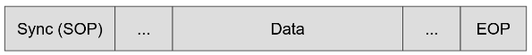
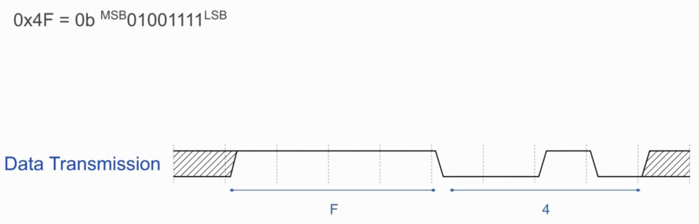
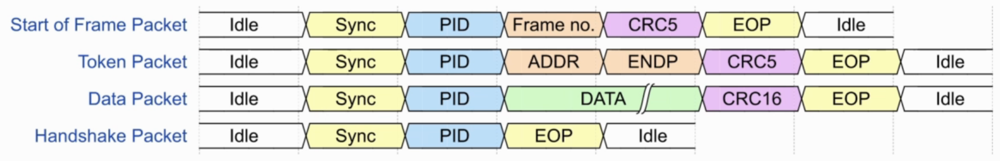
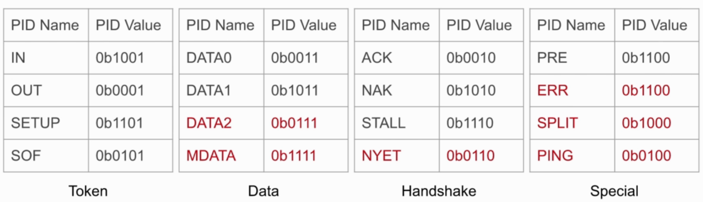
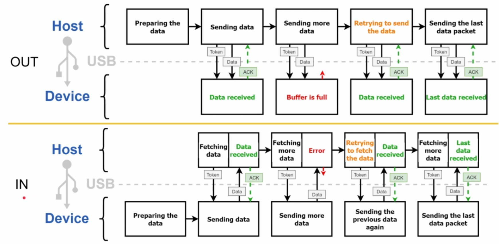
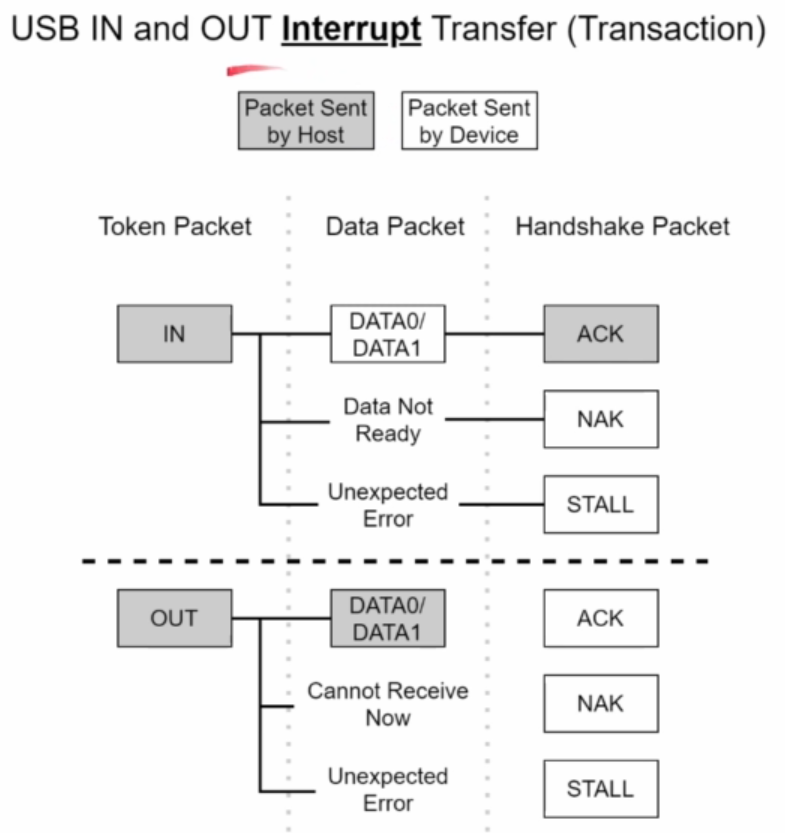
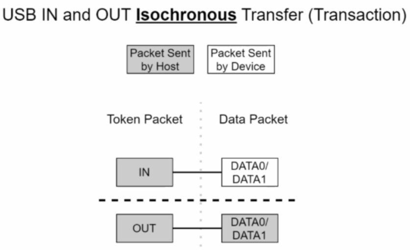
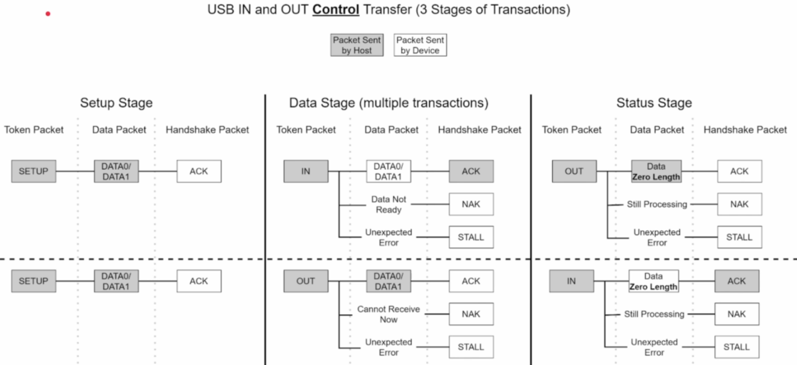

# USB Behind the Scenes: Hands-on HID Firmware Development

------

## Introduction to USB

------

### Definition:

- USB is a Serial Protocol used for transfer of data and power.
- Prior to USB multiple protocols and ports and respective drivers were needed. 
- USB was created to solve this problem and unify all standards.

###  History:

- USB 1.x (Jan 1996)

  - Low speed (1.5 Mbits/s) and Full Speed (12 Mbits/sec)
  - No Extensions were allowed due to timing and power issues
  - Wide adoption after releasing USB 1.1 (Sept 1998)
  - Connectors: A and B.																	

- USB 2.0(Apr 2000):
  - High Speed (480 Mbits/s).
  - On-The-Go (OTG) was introduced.
  - Dedicated charging ports (up to 1.5 A).
  - Connectors: Mini-A, Mini-B and Micro-USB

- USB 3.x(Nov 2008):
  - SuperSpeed (5 Gbits/s).
  - SuperSpeed+ (10 Gbits/s) after releasing USB 3.1 (Jul. 2013).
  - SuperSpeed+ dual-lane (20 Gbits/s) after releasing USB 3.2 (Aug 2017).
  - Connectors: only A and C. [Type B and micro B are also used](https://en.wikipedia.org/wiki/USB_hardware)

- USB 4 (Aug 2019):
  - Thunderbolt 3 hardware interface (40 Gbits/s).
  - Connectors: only C .

### USB 2.0 Cable Structure:

### USB Main Features

- Hot-pluggable (plug and play).
- Self configured.
- Some device can be powered directly from the USB(bus-powered).
- USB is host controlled (single host per bus).
- Every USB Product is programmed to have a vendor ID and Product ID(VID/PID)
- Every USB device is addressed by the host uniquely during device enumeration.
- USB is a **polled bus** (frequently sampled by both host and devices without including any interrupt mechanism in the USB controller and according to the state found on the bus after sampling the bus specific actions or events happen).

### Physical Bus Topology

- In USB, host and devices are connected physically to the bus according to the "tired-star" topology.

- Up top 127 devices  can be connected to the bus including the hubs (devices are 7 bit addressed , and address 0 is reserved as initial address for every new connected device)

- Up to 7 tiers are allowed.

- Up to 5 hubs can be connected in series.

   

### USB Device Power Supply

- Bus-Powered (VBUS): up to 500 mA for USB 2.0 , or up to 900 mA for USB 3.x

- Self-powered (external power supply):

  Devices that require more current than what VBUS can supply must use an external power supply.

- Mixing the two types is also possible  

  

### VBUS  

- The nominal VBUS voltage is normally ~5 V.

- VBUS voltage can drop down to ~ 4.4 V (according to the load on the VBUS).

- USB device can normally draw current from the host through the VBUS depending on its state:
  - **Not configured** (default state, newly connected device):

    USB 2.0: up to 100 mA.
    USB 3.x: up to 150 mA.

  - **Configured**(host and device have negotiated):

    USB 2.0: may **ask** to draw up to 500 mA (high power device).
    USB 3.x: may **ask** to draw up to 900 mA (high power device). 

    - **Suspended**(device is idle):

      Up to 0.5 mA (2.5 mA if configured as high power). The current of the pull up and pull down resistors must be considered (they sink ~ 0.2 mA).

- USB device can draw more current -if needed- according to battery charging and   power delivery specifications.
- USB BC(Battery Charging) spec 1.2 (Dec 2010): up to 1.5 A
- USB PD(Power Delivery) spec Ver 2 rev 3(Aug 2019): allows up to 100 watt (5 A by 20 V).

### Smart Charger

- The smart charger has a dedicated charging port (DCP) controller.

- The DCP tries different states(sine voltage, square voltage signal etc) and monitors the amount of the drawn current.

  

## USB Protocol

------

### Deferential states

|                | Full and High Speed | Low Speed    |
| -------------- | ------------------- | ------------ |
| Differential 0 | D+Low D-High        | D-Low D+High |
| Differential 1 | D-Low D+High        | D+Low D-High |

​									The Difference should be >= 200 mV.

- Differential states allows external noise to be filtered as D+ and D- are both going to be effected by noise equally hence the noise would be cancelled out in the output.

### Bus States

| State                | FS   | HS   | LS                      |
| -------------------- | :--: | ---- | ----------------------- |
| SE0 (Single Ended 0) |     both data lines are low      | same           | same           |
| Detached | SE0 | same | same |
| Idle | Differential 1 | SE0 | Differential 0 |
| J | Differential 1 (as idle state) | Differential 1 | Differential 0 |
| K | Differential 0 | Differential 0 | Differential 1 |
| ~~SE1 (single Ended 1)~~ | ~~both data lines are high (illegal)~~ | ~~same~~ | ~~same~~ |

### Bus States 2

| State                         | FS              | HS                               |
| ----------------------------- | --------------- | -------------------------------- |
| RESET                         | SE0 (>=10 ms)   | idle (3.15) then keeps the SE0   |
| Suspend                       | Idle (3 ms)     | Idle (3.125 ms) then FS idle (J) |
| Resume                        | K(20 ms) EOP.   | k (>= 20 ms)                     |
| Sync or Start of Packet (SOP) | K J K J K J K K | 15 times(K J) K K                |
| End of Packet (EOP)           | SE0 SE0 J       | 1111111(bit stuffing error)      |

### USB 2.0 Speed Identification

### Bit Stuffing

- The insertion of non-information bits(s) into the data.

- In USB FS/HS: **zero insertion after six consecutive ones**.
- Ensures adequate state transition on the line (to keep the clock in sync).

### Non-Return-To-Zero Inverted (NRZI)

- NRZI and Bit Stuffing are handled by hardware itself (USB controller)

- Zero inverts the line state as it is.

  

### USB Host Controllers

- USB 1.x:
  - Universal Host Controller Interface (UHCI): **software** has to do a lot of bus management work.
  - Open Host Controller Interface (OHCI): **hardware** is responsible for doing most of the bus management work.

- USB 2.0:
  - Extended Host Controller Interface (EHCI).

Host driver had to be written to support all of the these three controllers.

- USB 3.x (and the earlier versions):
  - Extensible Host Controller Interface (xHCI): the newest host controller which replaces the older controllers.

### Frames

- The times between two SOF signals is called a frame.

- SOF signal is used to keep the data on the bus in sync.

  

### Endpoints

- An endpoint is a logical entity and it can be seen as data sender or as data receiver (depending on the endpoint type).

- Endpoints can be found only in the USB device side not on the host. (hint: Endpoints are similar to ports on TCP)
- The **direction** of the endpoint is named from the **host perspective**.

- ​        IN: from device to host.          OUT: from host to device.
- Devices can have up to 16 IN and 16 OUT endpoints.
- IN endpoint X and OUT endpoint X are totally two different endpoints (exception endpoint 0). Example IN endpoint 2 is different from OUT endpoint 2.

- Every device must support the endpoint 0 IN and OUT.
- Endpoint zero is used to configure the device.
-  the host send configuration data to device over OUT endpoint 0 and device will reply to requests of the host using IN endpoint 0.

### [Packet and Transaction Types PDF](./PDFs/USB+Under+the+Microscope+-+Packets+and+Transaction+Types.pdf)

### Packets

- In USB data is transmitted as packets.
- Size of the packet is dependent on the endpoint which will send data to the host.

- **Packet Transmission**:
  - The bytes of a packet are transmitted least-significant bits first.

### Packet Types and Fields

- Start of Frame Packet is also a type of Token Packet
- Start of Frame Packet  starts with Sync /SOP followed by PID (Packet Identifier followed by Frame no which have no of the current frame followed by CRC5 and end with EOP.
- Token packet has all field present in start of packet in addition to this it has an device identifier field (ADDR) which represents the device to or from which the packet and the following packets are being sent as token packet describes not only about itself but also the packets that will follow it.
- Token packet has Endpoint number field (ENDP) which has the end point number from which this packet and the following packets are being sent.

- In Data packet starts with Sync /SOP followed by PID and followed by payload/data followed by CRC16 followed by EOP.
- Handshake packets is sent to tell about status of previous packet which is typically data packet
- They are different types of token packets, data packets ans handshake packets they differ from each other due to the value of the PID. 

### Transaction

- Every Transaction is a fully completed data exchange between host and the device.
- Every USB Transaction consists of a sequence of three(or two) packets:
  1. Token packets
  2. Data packets
  3. Handshake Packet (Isochronous transfer does not use handshake packet).

### Packet Identifiers

#### Token

Token packet indicates the start of a transaction of one of the following types:

- IN: indicates that the host will read data from the device.

- OUT: Indicates that the host will send data from the device.

- SETUP: Indicates that the host will send SETUP data to the device. (SETUP token packet indicates that host will send setup data, this setup data is noting but data packet follows the setup token and this data packet contains USB request from the host).

  - Setup token can only be used with certain type of endpoint i.e setup tokens are only send to control end points. endpoint 0 is a control end point.

- Token packet is always sent at the beginning of every USB transaction.

  

#### Data

- Data 0 and Data 1 packets do the exact same task, transmitting data.

- Data 0 and Data 1 are used alternatively just as a method of error checking. But their job is only to transfer data. 

- Sending payload in the data packet is optional, so sending a zero length data packet is also valid.

- Zero-length data packet  can be Data 0  or Data 1 packet that has no data in its Data field.

- Zero-length data packet tells mainly that sending data is done if the length of the last data packet equals endpoint's max size.

  

#### Handshake

Handshake packets indicates the end of a transaction with one of the following states:

- ACK:
  - The receiver acknowledges receiving the packet without error. 

- NAK:
  - The receiver cannot receive the data. eg: if receiver buffer is full
  - The sender cannot send the data now. 

- STALL:
  - An error happened, the devices puts the corresponding endpoint on hold.
  - The received SETUP request is not supported.

- some endpoints don't require handshaking, so such endpoints can send or receive data without the need to waiting for any handshaking packet or without the need to send any handshaking packet.

### Device Address

- Every USB device connected to the bus  has a unique address.

- Default device address is 0. 
- Device address is assigned by the host while enumerating the device.
- Device address can change when the device is disconnected and reconnected.

### Bus Polling

- Polling involves sampling  and not continuous monitoring. 
- In USB polling means checking the bus frequently to deal with bus changes rather than using interrupt mechanisms.
- Interrupt transfer is also implemented by polling (it is not really  an interrupt).

### USB is Host-Driven

- USB Transactions are triggered only by the host.
- To send data from host to device (OUT), the host informs the device that it will be receiving some amount of data (by sending OUT or SETUP token packet), then the host sends the data(data packets) until the whole data is sent.
- To send data from device to the host (IN) the device cannot simply control the bus and send the data whenever it wants. The Best the device can do is put the data on an end point and wait for IN token from the host when it needs the data only then the device sends them over the bus (as data packets).
- If the data requested by the host is not available in the device at the moment then the device will reply to this IN token with NAK

### Transfer Types (Endpoint Types)

- Interrupt transfer

- Bulk transfer
- Isochronous transfer
- Control transfer

USB devices tell the host about the configurations of its endpoints in the early stage of device enumeration.

#### Interrupt Transfer

- Periodic transfer
- Guarantees bus bandwidth (limited latency).
- Guarantees error-free transfer(has error detection).
- Used to get updates from a device regularly.
- Maximum data payload: up to 64 bytes for FS, and up to 1024 bytes for HS.
- Example: Mouse, Keyboard, and joystick.

#### Bulk Transfer

- Non-periodic transfer.
- No guarantee of bus bandwidth (no specific latency guaranteed).
- Guarantees error-free transfer (has error detection).
- Used to transfer large amount of data.
- Maximum packet size: 8, 16, 32, or 64 bytes for full speed, and 512 bytes for high speed.
- Low speed does not support bulk transfer.
- Example: writing data to an external USB storage.

Refer above figure of Interrupt transfer as transaction process is the same for Bulk Transfer.  

#### Isochronous Transfer

- Periodic Transfer.
- Guarantees bus bandwidth (limited latency).
- Does not have error detection.
- Used to transfer large amount of data without caring if some data gets missed or corrupted.
- Maximum data payload: up to 1023 bytes for FS, and up to 1024 bytes for HS.
- Example: typically used with cam stream and microphone.

#### Control Transfer

- Non-Periodic
- Guarantees error-free transfer (has error detection).
- Used to transfer device enumeration and configuration packets.
- **Endpoint 0** (IN and OUT) must be configured to operate as "Control Transfer".
- Maximum data payload: 8, 16, 32, or 64 bytes for full speed, and 64 bytes for high speed.

Control transfer consists of **three stages**:

1.  The **Setup Stage** (one Transaction).
   - The host sends a setup token which tells the device that in upcoming data packet there will be USB request coming from the host.
   - NAK and STALL Handshakes are not returned by device in this stage in case of error no response is provided by the device.
2. The **Data Stage** (optional; Zero to multiple transactions).
   - The number of data transactions during this stage depends on the USB request.
3. The **Status stage** (one transaction).
   - The Transaction  will be opposite of the data stage i.e if direction data send during data stage was out the host will send an IN during status stage.
   - The  data packet in the status stage has no data in it (Zero Length data packet).
   - It is just a signal to tell the Host or the Device that control transfer has just finished.

### Bus Bandwidth Allocation

When enumerating a USB device, **the host is responsible for allocating the bandwidth of the bus** for each endpoint of that device.

Bandwidth allocation priority:

1. ​	Periodic transfers (Interrupt and Isochronous):
   - A specific endpoint can have only one periodic transfer per frame.
   - Up to 90% of the bus bandwidth for full speed, and up to 80% of the bandwidth for high speed.
2. Control transfer: the remaining 10% (FS) or 20% (HS).
3. Bulk transfer: once everything else is allocated, the bulk takes the remaining bandwidth.

