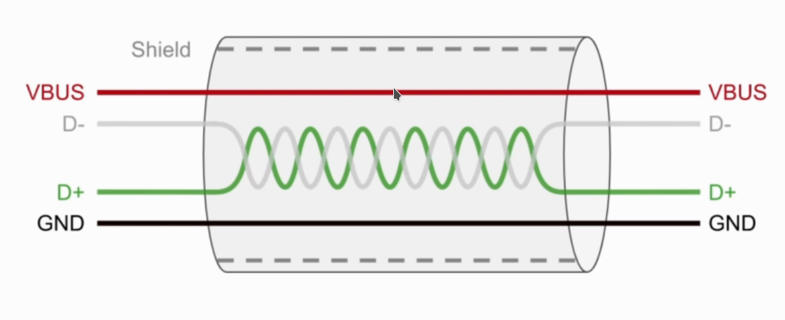

## USB Behind the Scenes: Hands-on HID Firmware Development

### Introduction:

- Serial Protocol used for transfer of data and power.
- Multiple protocols and ports and respective drivers were needed.

###  History:

- USB 1.x (Jan 1996)

  - Low speed (1.5 Mbits/s) and Full Speed (12 Mbits/sec)
  - No Extensions were allowed due to timing and power issues
  - Wide adoption after releasing USB 1.1 (Sept 1998)
  - Connectors: A and B.																	

- USB 2.0(Apr 2000):
  - High Speed (480 Mbits/s).
  - On-The-Go (OTG) was introduced.
  - Dedicated charging ports (up to 1.5 A).
  - Connectors: Mini-A, Mini-B and Micro-USB

- USB 3.x(Nov 2008):
  - SuperSpeed (5 Gbits/s).
  - SuperSpeed+ (10 Gbits/s) after releasing USB 3.1 (Jul. 2013).
  - SuperSpeed+ dual-lane (20 Gbits/s) after releasing USB 3.2 (Aug 2017).
  - Connectors: only A and C. [Type B and micro B are also used](https://en.wikipedia.org/wiki/USB_hardware)

- USB 4 (Aug 2019):
  - Thunderbolt 3 hardware interface (40 Gbits/s).
  - Connectors: only C .

#### USB 2.0 Cable Structure:

#### USB Main Features:

- Hot-pluggable (plug and play).
- Self configured.
- Some device can be powered directly from the USB(bus-powered).
- USB is host controlled (single host per bus).
- Every USB Product is programmed to have a vendor ID and Product ID(VID/PID)
- Every USB device is addressed by the host uniquely during device enumeration.
- USB is a polled bus (frequently sampled by both host and devices without including any interrupt mechanism in the USB controller and according to the state found on the bus after sampling the bus specific actions or events happen).

#### Physical Bus Topology:

- In USB, host and devices are connected physically to the bus according to the "tired-star" topology.

- Up top 127 devices  can be connected to the bus including the hubs (devices are 7 bit addressed , and address 0 is reserved as initial address for every new connected device)

- Up to 7 tiers are allowed.

- Up to 5 hubs can be connected in series.

   

  

