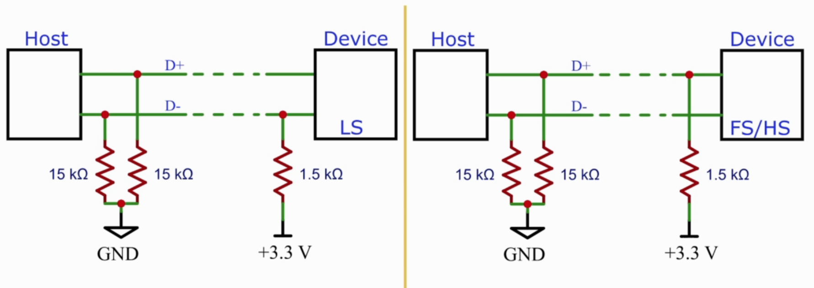

## USB Behind the Scenes: Hands-on HID Firmware Development

### Introduction:

- Serial Protocol used for transfer of data and power.
- Multiple protocols and ports and respective drivers were needed.

###  History:

- USB 1.x (Jan 1996)

  - Low speed (1.5 Mbits/s) and Full Speed (12 Mbits/sec)
  - No Extensions were allowed due to timing and power issues
  - Wide adoption after releasing USB 1.1 (Sept 1998)
  - Connectors: A and B.																	

- USB 2.0(Apr 2000):
  - High Speed (480 Mbits/s).
  - On-The-Go (OTG) was introduced.
  - Dedicated charging ports (up to 1.5 A).
  - Connectors: Mini-A, Mini-B and Micro-USB

- USB 3.x(Nov 2008):
  - SuperSpeed (5 Gbits/s).
  - SuperSpeed+ (10 Gbits/s) after releasing USB 3.1 (Jul. 2013).
  - SuperSpeed+ dual-lane (20 Gbits/s) after releasing USB 3.2 (Aug 2017).
  - Connectors: only A and C. [Type B and micro B are also used](https://en.wikipedia.org/wiki/USB_hardware)

- USB 4 (Aug 2019):
  - Thunderbolt 3 hardware interface (40 Gbits/s).
  - Connectors: only C .

### USB 2.0 Cable Structure:

### USB Main Features

- Hot-pluggable (plug and play).
- Self configured.
- Some device can be powered directly from the USB(bus-powered).
- USB is host controlled (single host per bus).
- Every USB Product is programmed to have a vendor ID and Product ID(VID/PID)
- Every USB device is addressed by the host uniquely during device enumeration.
- USB is a **polled bus** (frequently sampled by both host and devices without including any interrupt mechanism in the USB controller and according to the state found on the bus after sampling the bus specific actions or events happen).

### Physical Bus Topology

- In USB, host and devices are connected physically to the bus according to the "tired-star" topology.

- Up top 127 devices  can be connected to the bus including the hubs (devices are 7 bit addressed , and address 0 is reserved as initial address for every new connected device)

- Up to 7 tiers are allowed.

- Up to 5 hubs can be connected in series.

   

### USB Device Power Supply

- Bus-Powered (VBUS): up to 500 mA for USB 2.0 , or up to 900 mA for USB 3.x

- Self-powered (external power supply):

  Devices that require more current than what VBUS can supply must use an external power supply.

- Mixing the two types is also possible  

  

### VBUS  

- The nominal VBUS voltage is normally ~5 V.

- VBUS voltage can drop down to ~ 4.4 V (according to the load on the VBUS).

- USB device can normally draw current from the host through the VBUS depending on its state:
  - **Not configured** (default state, newly connected device):

    USB 2.0: up to 100 mA.
    USB 3.x: up to 150 mA.

  - **Configured**(host and device have negotiated):

    USB 2.0: may **ask** to draw up to 500 mA (high power device).
    USB 3.x: may **ask** to draw up to 900 mA (high power device). 

    - **Suspended**(device is idle):

      Up to 0.5 mA (2.5 mA if configured as high power). The current of the pull up and pull down resistors must be considered (they sink ~ 0.2 mA).

- USB device can draw more current -if needed- according to battery charging and   power delivery specifications.
- USB BC(Battery Charging) spec 1.2 (Dec 2010): up to 1.5 A
- USB PD(Power Delivery) spec Ver 2 rev 3(Aug 2019): allows up to 100 watt (5 A by 20 V).

### Smart Charger

- The smart charger has a dedicated charging port (DCP) controller.
- The DCP tries different states(sine voltage, square voltage signal etc) and monitors the amount of the drawn current.

### Deferential states

|                | Full and High Speed | Low Speed    |
| -------------- | ------------------- | ------------ |
| Differential 0 | D+Low D-High        | D-Low D+High |
| Differential 1 | D-Low D+High        | D+Low D-High |

​									The Difference should be >= 200 mV.

- Differential states allows external noise to be filtered as D+ and D- are both going to be effected by noise equally hence they output doesn't have noise

### Bus States

| State                | FS   | HS   | LS                      |
| -------------------- | :--: | ---- | ----------------------- |
| SE0 (Single Ended 0) |     both data lines are low      | same           | same           |
| Detached | SE0 | same | same |
| Idle | Differential 1 | SE0 | Differential 0 |
| J | Differential 1 (as idle state) | Differential 1 | Differential 0 |
| K | Differential 0 | Differential 0 | Differential 1 |
| ~~SE1 (single Ended 1)~~ | ~~both data lines are high (illegal)~~ | ~~same~~ | ~~same~~ |

### Bus States 2

| State                         | FS              | HS                               |
| ----------------------------- | --------------- | -------------------------------- |
| RESET                         | SE0 (>=10 ms)   | idle (3.15) then keeps the SE0   |
| Suspend                       | Idle (3 ms)     | Idle (3.125 ms) then FS idle (J) |
| Resume                        | K(20 ms) EOP.   | k (>= 20 ms)                     |
| Sync or Start of Packet (SOP) | K J K J K J K K | 15x(K J) K K                     |
| End of Packet (EOP)           | SE0 SE0 J       | 1111111(bit stuffing error)      |

### USB 2.0 Speed Identification

